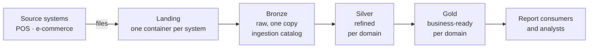
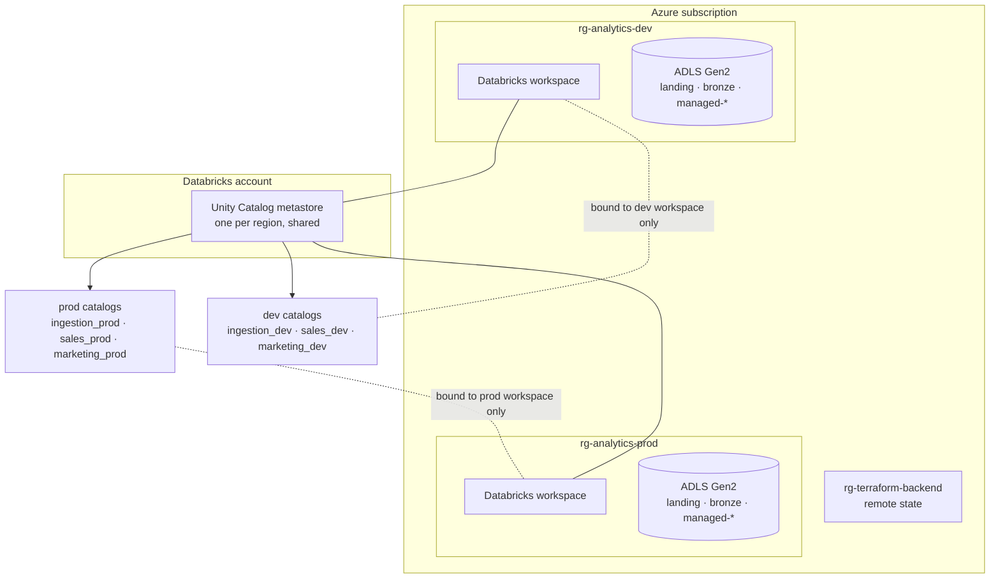
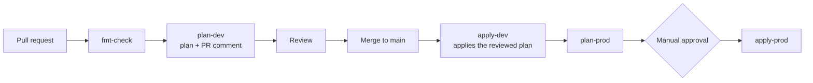

# Retail Analytics Platform — Terraform on Azure

Infrastructure as code for a cloud analytics platform: an Azure data lake, an
Azure Databricks workspace, and a Unity Catalog layout for Sales and Marketing
data, deployed to separate **dev** and **prod** environments through a GitHub
Actions pipeline with no stored secrets.

Built to show how a business requirements document turns into reproducible,
reviewable infrastructure. The platform (storage, catalogs, access control) is
built; the data pipelines that will fill it are not.

| | |
|---|---|
| **Cloud** | Azure (one subscription, `northeurope`) |
| **Analytics** | Azure Databricks, Unity Catalog |
| **IaC** | Terraform (`azurerm`, `databricks` providers) |
| **CI/CD** | GitHub Actions, OIDC (no client secrets) |
| **Status** | `dev` applied and converged · `prod` planned, not yet fully applied |

## What it builds



- **Landing:** raw files from each source system, kept for five years, then
  tiered to cheaper storage and deleted.
- **Bronze:** the single raw copy of the data, shared by every domain.
- **Silver and gold:** each business domain (`sales`, `marketing`) has its own
  catalog with refined and business-ready schemas.
- **Access:** report consumers see gold, analysts see silver and gold, data
  engineers see all stages. Every object is owned by a group, never a person.
- **Compute:** a serverless SQL warehouse in dev. A cluster is in the code but off
  (see Known limitations).

## Architecture at a glance



Dev and prod share one metastore but are isolated by Azure RBAC on each resource
group and by Unity Catalog workspace binding, which hides each environment's
catalogs from the other workspace even for users with grants.

## Terraform structure

Eight stateless modules (`naming`, `azure/{datalake,cost_budget}`,
`databricks/{workspace,compute,uc_storage,uc_ingestion,uc_domain_catalog}`), composed
by one root, `platform`, with a state per environment. `shared` holds the account-level
metastore. `uc_domain_catalog` is called once per domain, so adding a domain is one more
module call plus nesting the CI group in its governance group in Entra ID. Details:
[ARCHITECTURE](docs/ARCHITECTURE.html) and [IMPLEMENTATION](docs/IMPLEMENTATION.html).

## How a change reaches Azure



- Every PR runs `fmt-check` and `plan-dev` (plan, a destructive-change warning, and
  the plan as a PR comment). `main` is protected: both checks must pass.
- Merging runs `apply-dev` with the exact reviewed plan. `plan-prod` then runs and
  `apply-prod` waits for approval of the `production` environment.
- Merges only trigger `apply-*` for changes under `modules/`, `platform/`, `shared/`,
  `config/` or the workflow file.
- **Drift detection** is a manual workflow that plans `main` and never applies.

## Identity and security

- **No stored secrets.** GitHub exchanges a short-lived OIDC token for an Azure
  token through a federated credential. Each environment has its own service
  principal, scoped to its own resource group, so a `dev` pipeline cannot act as `prod`.
- **Groups, not people.** Access goes to Entra ID groups. Per domain: stakeholders,
  analysts, data engineers, and a governance group that owns the catalog (separate
  from the group that writes data).
- **CI is not a metastore admin.** It has explicit grants on what it manages; a few
  metastore grants are applied once by an admin.
- **Storage is protected:** `prevent_destroy` in every environment, 14-day soft delete
  in prod (7 elsewhere).
- **Cost alerts.** Each resource group, and each workspace's managed group, has a
  monthly budget that emails at 20% and 40%.

## Environments

| Environment | Purpose | Applied by | Scope |
|---|---|---|---|
| `dev` | Development platform | CI, automatically on merge | Contributor on its own resource group |
| `prod` | Production platform, **not yet applied** | CI behind manual approval; first apply is done by an admin | Contributor on its own resource group |
| `shared` | The account-level Unity Catalog metastore | By hand, by an account admin | Databricks account admin |

One root, `platform`, serves every environment. Each has its own state file in the
shared backend (`config/<env>/backend.hcl`) and its own values
(`config/<env>/values.tfvars`). `config/common.tfvars` holds shared values and is
**not** auto-loaded.

## Working with the repo

```bash
cd platform
terraform init -reconfigure -backend-config=../config/dev/backend.hcl        # or ../config/prod/backend.hcl
terraform plan -var-file=../config/common.tfvars -var-file=../config/dev/values.tfvars     # or ../config/prod/values.tfvars
```

- Sign in first with `az login`. Databricks resources use the same Azure identity.
- The backend file, values file and environment must all match. Mixing them (prod
  state with dev values) plans to destroy the other environment. Use `-reconfigure`
  when switching, and never accept a prompt to copy state.
- On a new environment, first apply the workspace
  (`-target=module.databricks_workspace.azurerm_databricks_workspace.this`), then a
  normal apply.

Every taggable resource carries `managed_by`, `repository`, `cost_center`,
`data_owner`, `workload` and `environment`. Names follow
`<type>-<workload>-<env>-<region>-<instance>`, for example `rg-analytics-dev-neu-01`.

## Documentation

| Document | Read it for |
|---|---|
| [PRD](docs/PRD.html) | The business requirements |
| [Architecture](docs/ARCHITECTURE.html) | Repo and pipeline design, the analytics platform design, and the key decisions |
| [Implementation](docs/IMPLEMENTATION.html) | Every module and object, the CI permission model, bootstrap |
| [Backlog](docs/BACKLOG.md) | Open work and known gaps |
| [Study material](misc/index.html) | A 20-lesson course on Terraform, the `azurerm` provider and Azure Databricks (open `misc/index.html` locally) |

## Repo layout

```text
.
├── modules/
│   ├── naming/                # name suffix and tags, no resources
│   ├── azure/
│   │   ├── datalake/          # resource group, storage account, containers
│   │   └── cost_budget/       # resource-group budget
│   └── databricks/
│       ├── workspace/         # workspace, access connector, metastore assignment
│       ├── compute/           # serverless SQL warehouse, optional cluster
│       ├── uc_storage/        # storage credential, external locations
│       ├── uc_ingestion/      # ingestion catalog, bronze schema, volumes
│       └── uc_domain_catalog/ # per-domain catalog, schemas, grants
├── platform/                 # the one root module for dev and prod
├── shared/                   # root module: account-level metastore, applied by hand
├── config/
│   ├── common.tfvars         # values shared by every environment
│   ├── dev/                  # backend.hcl (state key) and values.tfvars
│   └── prod/                 # backend.hcl (state key) and values.tfvars
├── docs/
│   ├── PRD.html              # business requirements
│   ├── ARCHITECTURE.html     # repo/CI-CD design (part 1) and platform design (part 2)
│   ├── IMPLEMENTATION.html   # every module and object
│   └── BACKLOG.md            # open work
├── misc/                     # study course: Terraform, azurerm, Databricks (HTML lessons)
└── .github/workflows/        # terraform.yml (plan/apply), drift-detection.yml
```

## Known limitations

- **One Azure subscription** (the account tier allows one), so environments are
  separated by resource-group RBAC. Splitting prod later is a configuration change.
- App registrations, the metastore and Entra ID groups were created once, outside
  Terraform, because a pipeline cannot create its own identity.
- The ingestion job that fills bronze is not built.
- **Compute is limited by the subscription:** a 4 vCPU quota and restricted VM
  sizes mean no classic cluster can start. Only a serverless SQL warehouse runs
  (see [Backlog](docs/BACKLOG.md), item 4).
- **Fixed cost:** each workspace's NAT gateway bills about 31 EUR a month even
  when idle. Accepted.
- `shared` is applied once, by hand, and has no CI job.
- Networking is deferred: public defaults, no private endpoints or VNet injection.
