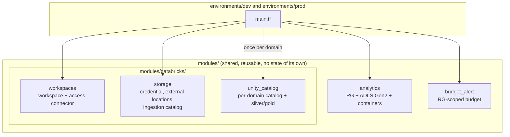

# code-test — Terraform + Azure learning project

A real (not fictional) Azure-backed Terraform project used to learn dev/prod
environment isolation, CI/CD with GitHub Actions, and OIDC-based identity —
alongside a Databricks/Unity Catalog data platform, which is why some naming
decisions below exist specifically to avoid colliding with catalog-tier names
(`dev`/`test`/`prod`) that Unity Catalog also uses for a different concept
(data catalogs, not infrastructure).

For full diagrams (module composition, Azure resource topology, the git →
CI/CD → Azure flow, OIDC identity exchange) see
**[docs/ARCHITECTURE.md](docs/ARCHITECTURE.md)**. For the reasoning behind
specific decisions, see the ADRs in `docs/adr/`.

## What this deploys

Five modules, reused across every environment. The first two are core Azure
infrastructure; the three under `modules/databricks/` implement the Databricks
Unity Catalog analytics platform (spec: [docs/analytics-platform/](docs/analytics-platform/)).

- **`modules/analytics`** — a resource group + an ADLS Gen2 storage
  account (naming derived from `workload`/`environment`/`location`/`instance`),
  with containers: `bronze`, one `landing-<system>` per source system
  (`pos`, `ecommerce`), and one `managed-<domain>` per Unity Catalog catalog.
  A lifecycle policy tiers/deletes landing files only (5-year retention).
- **`modules/budget_alert`** — a resource-group-scoped consumption budget
  with 20%/40% threshold notifications
- **`modules/databricks/workspaces`** — Databricks workspace (premium),
  access connector with Storage Blob Data Contributor, metastore assignment
- **`modules/databricks/storage`** — called once per environment: storage
  credential, bronze + per-source-system landing external locations, and the
  non-domain `ingestion_<env>` catalog (the single raw `bronze` schema,
  `<system>_landing` external volumes, one shared Auto Loader `checkpoints` volume)
- **`modules/databricks/unity_catalog`** — called once per business domain
  (`sales`, `marketing`): a `<domain>_<env>` catalog with `silver`/`gold`
  schemas, its own managed external location, and grants

Data flow: source systems write to `landing-<system>` → read-only external
location → `ingestion_<env>.bronze` (raw, one place) → each domain's `silver`
→ `gold`. Catalogs are workspace-bound (`ISOLATED`) so `dev` and `prod` can't
see each other's data even though they share one metastore.



## Environments

| Environment | Purpose | Lifecycle | CI identity | RBAC scope |
|---|---|---|---|---|
| `dev` | Real, Unity-Catalog-facing dev data platform | Long-lived, applied | `sp-terraform-dev` | Contributor on its own resource group only |
| `prod` | Real, Unity-Catalog-facing prod data platform | Long-lived, coded but **not yet applied** (first apply is an admin bootstrap) | `sp-terraform-prod` | Contributor on its own resource group only |
| `shared` | Account-level Databricks resources (the one metastore); applied by hand | Long-lived | a human/account admin (no CI yet) | Databricks account admin |

Each environment is a separate Terraform root module — its own state key in
the shared remote backend (`sttfstateanalyticsneu01` / container `tfstate`),
its own `terraform.tfvars`. Terraform has no built-in "environment" concept;
this separation is purely directory + backend-key based. Shared, genuinely
environment-independent values (`subscription_id`, `notify_email`,
`workload`, `instance`) live in `environments/common.tfvars`, which — unlike
`terraform.tfvars` — is **not** auto-loaded and must always be passed
explicitly:

```bash
# from environments/dev or environments/prod:
terraform plan -var-file=../common.tfvars -var-file=terraform.tfvars
```

## CI/CD

- Every PR runs `fmt-check` → `plan-dev` (init, validate, plan, a
  destructive-change check, and the plan posted as a PR comment).
- Merging to `main` triggers `apply-dev` automatically — it applies the
  *exact* plan artifact `plan-dev` already produced, never a fresh plan —
  then `plan-prod` runs the same init/validate/plan/check sequence against
  `prod`.
- `apply-prod` sits behind the `production` GitHub Environment's
  required-reviewer gate; once approved, it applies the exact `plan-prod`
  artifact.

The CI service principals are **not** Databricks metastore admins, so a few
things are deliberately admin-only and ignored by CI plans (notably the
metastore-level `CREATE_*` grants, via `lifecycle { ignore_changes = [grant] }`).
Because `apply-*` applies a frozen plan, a "Saved plan is stale" failure means
re-running the whole workflow, not one job. Details:
[IMPLEMENTATION.md](docs/analytics-platform/IMPLEMENTATION.md#ci-permission-model).

Identity is OIDC-based throughout — Terraform's `azurerm` provider fetches
its own short-lived Azure AD token directly (via GitHub's auto-injected
OIDC token endpoint, exchanged through an Entra federated identity
credential per environment); no client secrets are stored anywhere. Each
environment has its own App Registration / Service Principal, so a
compromised or misconfigured `dev` pipeline cannot authenticate as `prod`.

See **[docs/ARCHITECTURE.md](docs/ARCHITECTURE.md)** for the full flow
diagram and **[ADR-0002](docs/adr/0002-pipeline-and-identity-architecture.md)**
for why each of these pieces is built the way it is.

## Repo layout

```text
code-test/
├── modules/
│   ├── analytics/                # RG + ADLS Gen2 storage account + containers
│   ├── budget_alert/             # RG-scoped consumption budget
│   └── databricks/
│       ├── workspaces/           # workspace, access connector, metastore assignment
│       ├── storage/              # per env: credential, external locations, ingestion catalog
│       └── unity_catalog/        # per domain: catalog, silver/gold, grants
├── environments/                 # real, long-lived, Unity-Catalog-facing
│   ├── common.tfvars             # shared, environment-independent values
│   ├── dev/                      # root module -- own state, own tfvars
│   ├── prod/                     # root module -- own state, own tfvars
│   └── shared/                   # account-level metastore, applied by hand
├── docs/
│   ├── ARCHITECTURE.md           # repo/CI-CD diagrams (part 1) and the analytics platform design (part 2)
│   ├── analytics-platform/       # PRD, IMPLEMENTATION, BACKLOG for the Databricks platform
│   ├── azure-setup-commands.sh   # record of the one-time Azure bootstrap
│   └── adr/                      # architecture decision records
│       └── 0002-pipeline-and-identity-architecture.md
├── .github/workflows/terraform.yml
└── deploy.sh                     # manual prod plan/apply helper
```

## Known limitations (by design, for now)

- Everything runs in **one Azure subscription** (Free Trial billing — Azure
  blocks creating additional subscriptions until upgraded to Pay-As-You-Go),
  isolated by resource-group-scoped RBAC rather than a subscription
  boundary — see `docs/ARCHITECTURE.md`'s "Environments and isolation"
  section for the tradeoff this implies.
- Entra ID groups (`grp-<domain>-*-<env>`, `grp-databricks-*`) and their sync
  to the Databricks account are managed outside Terraform. `marketing`'s
  business-group grants stay off (`enable_grants = false`) until those groups
  are registered; the Auto Loader ingestion job and its pipeline service
  principal are not built yet (see
  [BACKLOG.md](docs/analytics-platform/BACKLOG.md)).
- App registrations / service principals were created via one-time `az` CLI
  commands (recorded in `docs/azure-setup-commands.sh`), not via Terraform —
  this avoids a bootstrap circularity (the identity a pipeline authenticates
  as can't be created by that same pipeline's own run). A future step could
  move this into a separate, human-applied `bootstrap/` Terraform root using
  the `azuread` provider.
- The subscription-wide `Cost Management Contributor` grant on
  `sp-terraform-dev`/`sp-terraform-prod` predated the resource-group-scoped
  budget refactor (see
  [ADR-0002](docs/adr/0002-pipeline-and-identity-architecture.md#budget-scope))
  and has since been revoked — each SP's existing RG-scoped Contributor
  role already covers everything it was granted for.
