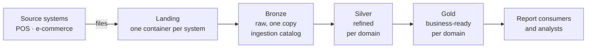
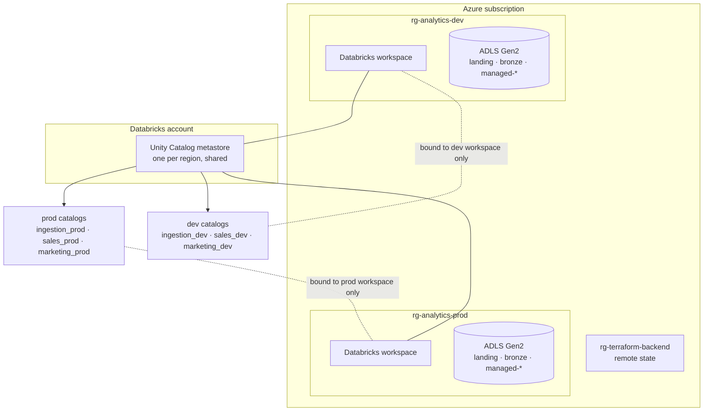
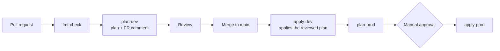

# Retail Sales Analytics Platform — Terraform on Azure

Infrastructure as code for a cloud analytics platform: an Azure data lake, an
Azure Databricks workspace, and a Unity Catalog layout for Sales and Marketing
data, deployed to separate **dev** and **prod** environments through a GitHub
Actions pipeline with no stored secrets.

It is a real (not fictional) project, built to show how a business requirements
document turns into reproducible, reviewable infrastructure. The platform itself
(storage, catalogs, access control) is built; the data pipelines that will fill
it are not.

| | |
|---|---|
| **Cloud** | Azure (one subscription, `northeurope`) |
| **Analytics** | Azure Databricks, Unity Catalog |
| **IaC** | Terraform (`azurerm`, `databricks` providers) |
| **CI/CD** | GitHub Actions, OIDC (no client secrets) |
| **Status** | `dev` applied and converged · `prod` planned, not yet fully applied |

## What it builds



- **Landing:** raw files from each source system, kept for five years, then
  tiered to cheaper storage and deleted.
- **Bronze:** the single raw copy of the data, shared by every domain.
- **Silver and gold:** each business domain (`sales`, `marketing`) has its own
  catalog with refined and business-ready schemas.
- **Access:** report consumers see gold, analysts see silver and gold, data
  engineers see all stages. Every object is owned by a group, never a person.
- **Compute:** a serverless SQL warehouse (2X-Small, stops after 10 idle minutes)
  in dev. A single-node cluster is in the code but switched off, because no
  classic cluster can start on this subscription (see Known limitations).

## Architecture at a glance



Dev and prod share one metastore but stay isolated at two independent layers:
Azure RBAC scoped to each environment's resource group, and Unity Catalog
workspace binding, which hides each environment's catalogs from the other
workspace even for users who hold grants.

## Terraform structure

Eight reusable modules with no state of their own: `naming` (the name suffix and
tag set, computed once per root), and, grouped by plane, `azure/`
(`datalake`: resource group, storage, containers; `cost_budget`) and `databricks/`
(`workspace`, `compute`, `uc_storage`, `uc_ingestion`, `uc_domain_catalog`). One root,
`platform`, composes them for every environment and keeps a state
per environment; `shared` holds the account-level metastore. `uc_domain_catalog` is called once per business domain,
so adding a domain is one more module call, plus nesting the CI group in the
domain's governance group in Entra ID (see [IMPLEMENTATION](docs/IMPLEMENTATION.html)). `uc_storage` and `uc_ingestion` are
called once per environment because the storage credential and the raw ingestion
layer are shared by every domain.
The module diagram and every object are in [ARCHITECTURE](docs/ARCHITECTURE.html)
and [IMPLEMENTATION](docs/IMPLEMENTATION.html).

## How a change reaches Azure



- Every PR runs `fmt-check` and `plan-dev` (init, validate, plan, a check for
  destructive changes, and the plan posted as a PR comment).
- `main` is protected: changes go in through a pull request with both checks green.
- Merging triggers `apply-dev`, which applies the exact plan artifact that was
  reviewed, never a fresh plan. `plan-prod` then runs, and `apply-prod` waits for a
  reviewer to approve the `production` environment.
- Checks run on every PR, including docs-only ones, so the required checks always
  report. Merges to `main` only trigger `apply-*` for changes under `modules/`,
  `platform/`, `shared/`, `config/` or the workflow file.
- **Drift detection** is a separate manual workflow. It plans `main` and fails on
  any difference between the code and what is deployed. It never applies.

## Identity and security

- **No stored secrets.** GitHub exchanges a short-lived OIDC token for an Azure
  token through a federated credential. Each environment has its own service
  principal, scoped to its own resource group, so a `dev` pipeline cannot act as `prod`.
- **Groups, not people.** Access is granted to Entra ID groups synced to Databricks.
  Roles per domain: stakeholders, analysts, data engineers, and a data-governance
  group that owns the catalog (kept separate from the group that writes data).
- **CI is not a metastore admin.** It holds explicit grants on what it manages.
  A few metastore-level grants are applied once by an admin and ignored by CI plans.
- **Storage is protected**: `prevent_destroy` on the storage account and containers in every environment, plus 14-day soft delete in prod (7 elsewhere).
- **Cost alerts.** Each environment's resource group, and each workspace's managed
  resource group, has a monthly budget that emails at 20% and 40% of the amount.

## Environments

| Environment | Purpose | Applied by | Scope |
|---|---|---|---|
| `dev` | Development platform | CI, automatically on merge | Contributor on its own resource group |
| `prod` | Production platform, **not yet applied** | CI behind manual approval; first apply is done by an admin | Contributor on its own resource group |
| `shared` | The account-level Unity Catalog metastore | By hand, by an account admin | Databricks account admin |

One Terraform root, `platform`, serves every environment. Each
environment has its own state file in the shared backend
(`sttfstateanalyticsneu01`, container `tfstate`), chosen by
`config/<env>/backend.hcl`, and its own values in `config/<env>/values.tfvars`.
Values common to all environments live in `config/common.tfvars`, which is
**not** auto-loaded.

## Working with the repo

```bash
cd platform
terraform init -reconfigure -backend-config=../config/dev/backend.hcl        # or ../config/prod/backend.hcl
terraform plan -var-file=../config/common.tfvars -var-file=../config/dev/values.tfvars     # or ../config/prod/values.tfvars
```

- Sign in first with `az login`. Databricks resources use the same Azure identity.
- The backend file, the values file and the environment must all be the same one
  (`dev` or `prod`). Mixing them, for example prod state with dev values, plans to
  destroy the other environment's resources. Add `-reconfigure` to `init` when
  switching; never answer yes to a prompt that offers to copy state.
- On a brand-new environment, apply the workspace first
  (`-target=module.databricks_workspace.azurerm_databricks_workspace.this`), then
  run a normal apply. Later applies are a single step.

Every taggable resource carries `managed_by`, `repository`, `cost_center`,
`data_owner`, `workload` and `environment`. Names follow
`<type>-<workload>-<env>-<region>-<instance>`, for example `rg-analytics-dev-neu-01`.

## Documentation

| Document | Read it for |
|---|---|
| [PRD](docs/PRD.html) | The business requirements |
| [Architecture](docs/ARCHITECTURE.html) | Repo and pipeline design, the analytics platform design, and the key decisions |
| [Implementation](docs/IMPLEMENTATION.html) | Every module and object, the CI permission model, bootstrap |
| [Backlog](docs/BACKLOG.md) | Open work and known gaps |
| [Study material](misc/index.html) | A 20-lesson course on Terraform, the `azurerm` provider and Azure Databricks (open `misc/index.html` locally) |

## Repo layout

```text
.
├── modules/
│   ├── naming/                # name suffix and tags, no resources
│   ├── azure/
│   │   ├── datalake/          # resource group, storage account, containers
│   │   └── cost_budget/       # resource-group budget
│   └── databricks/
│       ├── workspace/         # workspace, access connector, metastore assignment
│       ├── compute/           # serverless SQL warehouse, optional cluster
│       ├── uc_storage/        # storage credential, external locations
│       ├── uc_ingestion/      # ingestion catalog, bronze schema, volumes
│       └── uc_domain_catalog/ # per-domain catalog, schemas, grants
├── platform/                 # the one root module for dev and prod
├── shared/                   # root module: account-level metastore, applied by hand
├── config/
│   ├── common.tfvars         # values shared by every environment
│   ├── dev/                  # backend.hcl (state key) and values.tfvars
│   └── prod/                 # backend.hcl (state key) and values.tfvars
├── docs/
│   ├── PRD.html              # business requirements
│   ├── ARCHITECTURE.html     # repo/CI-CD design (part 1) and platform design (part 2)
│   ├── IMPLEMENTATION.html   # every module and object
│   └── BACKLOG.md            # open work
├── misc/                     # study course: Terraform, azurerm, Databricks (HTML lessons)
└── .github/workflows/        # terraform.yml (plan/apply), drift-detection.yml
```

## Known limitations

- Everything runs in **one Azure subscription** (the account tier allows only one),
  so environments are separated by resource-group RBAC rather than a subscription
  boundary. Splitting prod later is a configuration change, not a redesign.
- App registrations, the metastore, and Entra ID groups were created by one-time
  steps outside Terraform, because a pipeline cannot create the identity it runs as.
- Business-group grants for `marketing` are still switched off in code (a literal
  `false`), although its groups are now registered in Databricks. The ingestion
  job that fills bronze is not built.
- **Compute is limited by the subscription.** It has a 4 vCPU regional quota in
  `northeurope`, and the usual small VM sizes are restricted, so no classic
  cluster can start. Only a serverless SQL warehouse runs; Python runs on
  serverless notebook compute. See [Backlog](docs/BACKLOG.md), item 4a.
- **Fixed cost.** Each workspace's managed network has a NAT gateway that bills
  about 1 EUR a day (about 31 EUR a month) whether or not anything runs. This is
  accepted for now.
- `shared` is applied once, by hand, and has no CI job.
- Networking is deferred: public defaults, no private endpoints or VNet injection.
