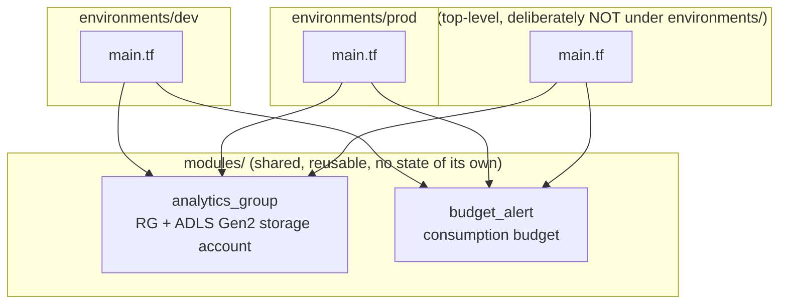
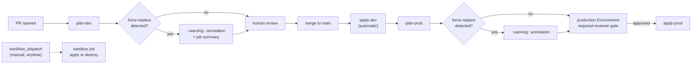

# code-test — Terraform + Azure learning project

A real (not fictional) Azure-backed Terraform project used to learn dev/prod
environment isolation, CI/CD with GitHub Actions, and OIDC-based identity —
alongside a Databricks/Unity Catalog data platform, which is why some naming
decisions below exist specifically to avoid colliding with catalog-tier names
(`dev`/`test`/`prod`) that Unity Catalog also uses for a different concept
(data catalogs, not infrastructure).

## What this deploys

Two modules, reused across every environment:

- **`modules/analytics_group`** — a resource group + an ADLS Gen2 storage
  account (naming derived from `workload`/`environment`/`location`/`instance`)
- **`modules/budget_alert`** — a subscription consumption budget with
  threshold notifications



## Environments

| Environment | Purpose | Lifecycle | CI identity | RBAC scope |
|---|---|---|---|---|
| `dev` | Real, Unity-Catalog-facing dev data platform | Long-lived | `sp-terraform-dev` | Contributor on its own RG only |
| `prod` | Real, Unity-Catalog-facing prod data platform | Long-lived | `sp-terraform-prod` | Contributor on its own RG only |
| `sandbox` | Disposable infra testing — never registered in Unity Catalog | Created/destroyed freely | `sp-terraform-sandbox` | Contributor on the **whole subscription** (see [ADR-0001](docs/adr/0001-sandbox-subscription-scope.md)) |

**What a clean sandbox run proves, and what it doesn't:** sandbox is
destroyed and rebuilt from empty on every run, so it can only validate
things that don't depend on history — that Azure's API accepts a given
configuration, that the CI identity's RBAC is sufficient, that a new
resource type wires up at all (all real failure modes `plan` can't catch,
since `plan` never calls Azure's actual validation). It cannot prove a
change is safe against `dev`/`prod`'s real accumulated state — existing
data, downstream consumers, or out-of-band drift. Don't read "sandbox
passed" as "safe to apply to dev/prod" — read it as "this can exist, and
this identity can create it."

Each environment is a separate Terraform root module — its own state key in
the shared remote backend (`sttfstateanalyticsneu01` / container `tfstate`),
its own `terraform.tfvars`. Terraform has no built-in "environment" concept;
this separation is purely directory + backend-key based. Shared, genuinely
environment-independent values (`subscription_id`, `notify_email`,
`workload`, `instance`) live in `environments/common.tfvars`, which — unlike
`terraform.tfvars` — is **not** auto-loaded and must always be passed
explicitly:

```bash
# from environments/dev or environments/prod:
terraform plan -var-file=../common.tfvars -var-file=terraform.tfvars

# from sandbox/ (one directory shallower, so one fewer ../):
terraform plan -var-file=../environments/common.tfvars -var-file=terraform.tfvars
```

`sandbox/` deliberately sits as a **top-level sibling** of `environments/`,
not nested inside it — the directory tree itself should say "this one isn't
a real data environment" without needing to read further. See
[ADR-0001](docs/adr/0001-sandbox-subscription-scope.md).

## CI/CD



Identity is OIDC-based throughout (`azure/login@v2` + Entra federated
credentials) — no client secrets stored anywhere. Each environment has its
own App Registration / Service Principal, so a compromised or misconfigured
dev pipeline cannot authenticate as prod.

## Repo layout

```text
code-test/
├── modules/
│   ├── analytics_group/
│   └── budget_alert/
├── environments/            # real, long-lived, Unity-Catalog-facing
│   ├── common.tfvars
│   ├── dev/
│   └── prod/
├── sandbox/                 # disposable infra testing -- NOT under environments/
├── docs/
│   ├── azure-setup-commands.sh   # record of the one-time Azure bootstrap
│   └── adr/                      # architecture decision records
├── .github/workflows/terraform.yml
└── deploy.sh                     # manual prod plan/apply helper
```

## Known limitations (by design, for now)

- Everything runs in **one Azure subscription** (Free Trial billing — Azure
  blocks creating additional subscriptions until upgraded to Pay-As-You-Go).
  See [ADR-0001](docs/adr/0001-sandbox-subscription-scope.md) for the
  concrete consequence of this.
- App registrations / service principals were created via one-time `az` CLI
  commands (recorded in `docs/azure-setup-commands.sh`), not via Terraform —
  this avoids a bootstrap circularity (the identity a pipeline authenticates
  as can't be created by that same pipeline's own run). A future step could
  move this into a separate, human-applied `bootstrap/` Terraform root using
  the `azuread` provider.
