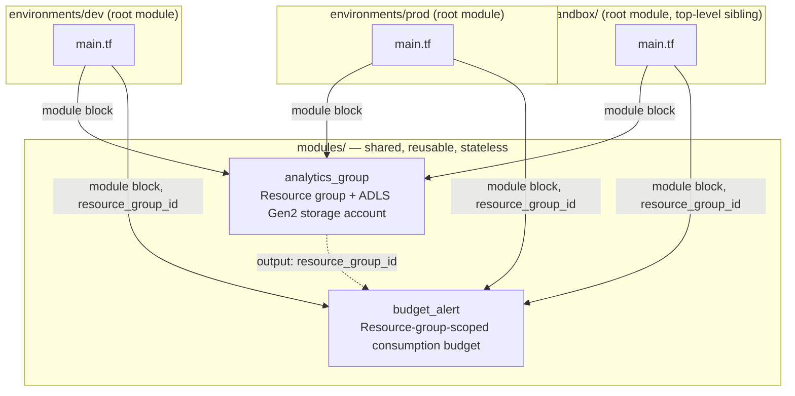
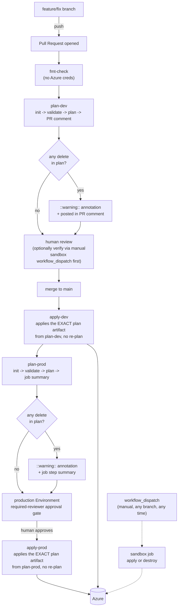

# Architecture

Diagrams-first reference for how this repo is organized, how a change moves
from a feature branch to real Azure resources, and how the pieces relate.
For the reasoning behind each decision, see the ADRs linked at the bottom of
each section.

## 1. Module / environment composition

Two reusable modules, composed once per root. Nothing in `modules/` holds
its own state or backend — each root under `environments/` (plus the
top-level `sandbox/`) is what actually gets applied.

Each root has its own `terraform.tfvars` (environment-specific values:
`instance`, `budget_amount`, an optional `storage_account_suffix`) and
shares environment-independent values via `environments/common.tfvars`
(`subscription_id`, `notify_email`, `workload`), which is **not**
auto-loaded and must always be passed explicitly with `-var-file`.

See: [ADR-0002](adr/0002-pipeline-and-identity-architecture.md#module-structure).

## 2. Azure resource topology

One subscription (Free Trial billing — see
[ADR-0001](adr/0001-sandbox-subscription-scope.md)), four resource groups,
one shared Terraform backend storage account.

```mermaid
flowchart TB
    subgraph sub["Subscription (single, shared by all environments)"]
        rgbackend["rg-terraform-backend\nsttfstateanalyticsneu01 / container tfstate\nholds ALL environments' state files"]
        rgdev["rg-analytics-dev-neu-01\nstanalyticsdevneu01"]
        rgprod["rg-analytics-prod-neu-01\nstanalyticsprodneu01b"]
        rgsandbox["rg-analytics-sandbox-neu-01\n(created + destroyed per run)"]
    end

    spdev["sp-terraform-dev\nContributor on rgdev only"] -->|scoped to| rgdev
    spprod["sp-terraform-prod\nContributor on rgprod only"] -->|scoped to| rgprod
    spsandbox["sp-terraform-sandbox\nContributor on the WHOLE subscription"] -.->|scoped to, see ADR-0001| sub

    style rgbackend fill:#2c3e50,stroke:#95a5a6
    style rgsandbox fill:#4a3b1f,stroke:#d4a72c
```

Each resource group holds one budget alert, scoped to that resource group
(not the subscription — see
[ADR-0002](adr/0002-pipeline-and-identity-architecture.md#budget-scope)),
notifying at 20% and 40% of the configured monthly amount.

`stanalyticsprodneu01b` carries a trailing `b`: Azure storage account names
are globally unique across *every* Azure customer, not just this
subscription, and `stanalyticsprodneu01` collided with an unrelated
account — `storage_account_suffix` exists as a narrow escape hatch for
exactly this, touching only the storage account name, never the resource
group's.

## 3. Git branch flow → CI/CD → Azure

Key properties, each with its own ADR-0002 subsection:

- **Plan and apply are decoupled.** `apply-dev`/`apply-prod` never run
  `terraform plan` themselves — they download the exact `tfplan` artifact
  the corresponding `plan-*` job already produced and uploaded, so what a
  human reviewed is *bit-for-bit* what gets applied.
- **`dev` deploys automatically on merge; `prod` waits for a human.** The
  only gate on `prod` is the `production` GitHub Environment's required
  reviewer — nothing about `prod`'s secrets or identity is hidden behind
  that gate, since a `client-id` isn't secret material (see
  [ADR-0002](adr/0002-pipeline-and-identity-architecture.md#environments-are-a-gate-not-a-secret-store)).
- **`sandbox` is disconnected from this flow entirely.** It never runs on
  push or PR — only on manual `workflow_dispatch`, from any branch, whenever
  someone wants to verify a risky change against real Azure before merging.

## 4. Identity: three independent OIDC trust relationships

```mermaid
flowchart LR
    subgraph gha["GitHub Actions run"]
        job["job step: terraform plan/apply"]
    end
    job -->|1: request short-lived JWT| ghoidc["GitHub OIDC token endpoint\n(ACTIONS_ID_TOKEN_REQUEST_*)"]
    ghoidc -->|2: signed GitHub JWT\nsub: repo:owner@id/repo@id:ref:...| entra["Microsoft Entra ID\nfederated identity credential"]
    entra -->|3: subject string match\nagainst the SP's federated credential| entra
    entra -->|4: Azure AD access token\nfor this SP only| job
    job -->|5: ARM API calls, scoped by RBAC| azure[("Azure Resource Manager")]

    style ghoidc fill:#1f2937,stroke:#60a5fa
    style entra fill:#1f2937,stroke:#60a5fa
```

The GitHub-issued JWT is **never** sent to Azure directly — it's exchanged
for a separate Azure AD token, and that exchange only succeeds if the JWT's
`sub` claim matches one of the federated credentials configured on that
specific App Registration. Three App Registrations
(`sp-terraform-dev`/`-prod`/`-sandbox`), each with its own federated
credential subject and its own RBAC scope, means a compromised or
misconfigured `dev` pipeline run cannot mint a token that authenticates as
`prod`.

See: [ADR-0002](adr/0002-pipeline-and-identity-architecture.md#oidc-identity-per-environment).

## 5. Decision index

| Decision | ADR |
|---|---|
| Why `sandbox` holds subscription-wide Contributor instead of RG-scoped | [ADR-0001](adr/0001-sandbox-subscription-scope.md) |
| Why each environment gets its own OIDC identity | [ADR-0002](adr/0002-pipeline-and-identity-architecture.md#oidc-identity-per-environment) |
| Why `apply-*` downloads a plan artifact instead of re-planning | [ADR-0002](adr/0002-pipeline-and-identity-architecture.md#plan-apply-decoupling) |
| Why GitHub Environments gates prod but doesn't hold its secrets | [ADR-0002](adr/0002-pipeline-and-identity-architecture.md#environments-are-a-gate-not-a-secret-store) |
| Why budgets are resource-group-scoped, not subscription-scoped | [ADR-0002](adr/0002-pipeline-and-identity-architecture.md#budget-scope) |
| Why force-replace detection flags any `delete`, not just paired `delete+create` | [ADR-0002](adr/0002-pipeline-and-identity-architecture.md#destructive-change-detection) |
