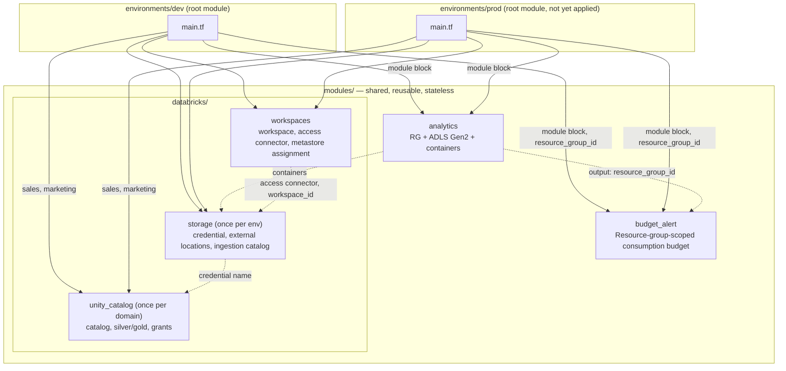
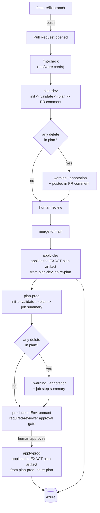

# Architecture

How this repo is organized and how the analytics platform is designed. The main
decisions and their reasons are listed under [Key decisions](#5-key-decisions).

- **[Part 1: Repository, pipeline and identity](#part-1--repository-pipeline-and-identity)**:
  module composition, Azure topology, the git → CI/CD → Azure flow, and the OIDC
  identity exchange.
- **[Part 2: Analytics platform](#part-2--analytics-platform-databricks-and-unity-catalog)**:
  the Azure / Databricks / Terraform design that satisfies
  [PRD.md](analytics-platform/PRD.md). Every module and object, and how they are operated, is in
  [IMPLEMENTATION.md](analytics-platform/IMPLEMENTATION.md); open work is in
  [BACKLOG.md](analytics-platform/BACKLOG.md).

## Part 1 — Repository, pipeline and identity

### 1. Module / environment composition

Five reusable modules, composed per root. Nothing in `modules/` holds
its own state or backend — each root under `environments/` is what
actually gets applied. `environments/shared` is a third root holding the
account-level Databricks metastore (applied by hand, no CI yet).



The Databricks/Unity Catalog design (catalog-per-domain, single ingestion
bronze, workspace-bound catalogs, group-based access) is in
[Part 2](#part-2--analytics-platform-databricks-and-unity-catalog) below, with
every object described in
[analytics-platform/IMPLEMENTATION.md](analytics-platform/IMPLEMENTATION.md).

Each root has its own `terraform.tfvars` (environment-specific values:
`instance`, `budget_amount`, an optional `storage_account_suffix`) and
shares environment-independent values via `environments/common.tfvars`
(`subscription_id`, `notify_email`, `workload`), which is **not**
auto-loaded and must always be passed explicitly with `-var-file`.

### 2. Azure resource topology

One subscription (Free Trial billing — Azure blocks creating additional
subscriptions until upgraded to Pay-As-You-Go), three resource groups, one
shared Terraform backend storage account.

```mermaid
flowchart TB
    subgraph sub["Subscription (single, shared by all environments)"]
        rgbackend["rg-terraform-backend\nsttfstateanalyticsneu01 / container tfstate\nholds ALL environments' state files"]
        rgdev["rg-analytics-dev-neu-01\nstanalyticsdevneu01"]
        rgprod["rg-analytics-prod-neu-01\nstanalyticsprodneu01b"]
    end

    spdev["sp-terraform-dev\nContributor on rgdev only"] -->|scoped to| rgdev
    spprod["sp-terraform-prod\nContributor on rgprod only"] -->|scoped to| rgprod

    style rgbackend fill:#2c3e50,stroke:#95a5a6
```



Each environment's resource group also holds the Databricks workspace and access
connector; the workspace's own managed resource group is budgeted separately.
Each resource group holds one budget alert, scoped to that resource group
(not the subscription),
notifying at 20% and 40% of the configured monthly amount.

`stanalyticsprodneu01b` carries a trailing `b`: Azure storage account names
are globally unique across *every* Azure customer, not just this
subscription, and `stanalyticsprodneu01` collided with an unrelated
account — `storage_account_suffix` exists as a narrow escape hatch for
exactly this, touching only the storage account name, never the resource
group's.

### 3. Git branch flow → CI/CD → Azure



Key properties (the reasons are under [Key decisions](#5-key-decisions)):

- **Plan and apply are decoupled.** `apply-dev`/`apply-prod` never run
  `terraform plan` themselves — they download the exact `tfplan` artifact
  the corresponding `plan-*` job already produced and uploaded, so what a
  human reviewed is *bit-for-bit* what gets applied.
- **`dev` deploys automatically on merge; `prod` waits for a human.** The
  only gate on `prod` is the `production` GitHub Environment's required
  reviewer — nothing about `prod`'s secrets or identity is hidden behind
  that gate, since a `client-id` isn't secret material.

### 4. Identity: one OIDC trust relationship per environment



```mermaid
flowchart LR
    subgraph gha["GitHub Actions run"]
        job["job step: terraform plan/apply"]
    end
    job -->|1: request short-lived JWT| ghoidc["GitHub OIDC token endpoint\n(ACTIONS_ID_TOKEN_REQUEST_*)"]
    ghoidc -->|2: signed GitHub JWT\nsub: repo:owner@id/repo@id:ref:...| entra["Microsoft Entra ID\nfederated identity credential"]
    entra -->|3: subject string match\nagainst the SP's federated credential| entra
    entra -->|4: Azure AD access token\nfor this SP only| job
    job -->|5: ARM API calls, scoped by RBAC| azure[("Azure Resource Manager")]

    style ghoidc fill:#1f2937,stroke:#60a5fa
    style entra fill:#1f2937,stroke:#60a5fa
```

The GitHub-issued JWT is **never** sent to Azure directly — it's exchanged
for a separate Azure AD token, and that exchange only succeeds if the JWT's
`sub` claim matches one of the federated credentials configured on that
specific App Registration. Two App Registrations
(`sp-terraform-dev`/`-prod`), each with its own federated credential
subject and its own RBAC scope, means a compromised or misconfigured `dev`
pipeline run cannot mint a token that authenticates as `prod`.

### 5. Key decisions

| Decision | Why |
|---|---|
| One Terraform root per environment, each with its own state, instead of one root with per-environment conditionals | A `dev` change cannot surface in a `prod` plan, and one state file never spans every environment |
| One OIDC identity (App Registration and federated credential) per environment | A bug or leaked credential in the `dev` pipeline cannot mint a token that acts as `prod`; no secret is stored anywhere |
| `apply-*` applies the saved plan and never re-plans | What a human reviewed is exactly what is applied, with no window for state or providers to change in between |
| The `production` GitHub Environment is only an approval gate and holds no secrets | A client ID is not secret. The real boundary is the federated-credential subject match plus RBAC scope, and hiding the ID behind an Environment would only stop `plan-prod` from running |
| Budgets are scoped to the resource group, not the subscription | One subscription-scoped budget would be a single resource shared by both environments and would need subscription-wide RBAC. A budget per resource group has no shared resource and works with the RG-scoped Contributor role |
| Destructive-change detection flags any `delete` in a plan | A resource-type swap appears as a separate delete and create, not a paired replace. The warning is informational and never blocks a merge |

## Part 2 — Analytics platform (Databricks and Unity Catalog)

**Scope:** infrastructure only — what must exist so a pipeline can be built.
Schema design, transformations, data quality, and orchestration are pipeline
concerns and out of scope (PRD §5).

**Status:** `dev` is applied and converged. `prod` is coded identically but
not yet applied.

### At a glance

```text
                     Terraform (environments/dev, environments/prod)
                                        │
        ┌───────────────────────────────┴───────────────────────────────┐
        ▼                                                               ▼
  rg-analytics-dev-neu-01                                  rg-analytics-prod-neu-01
  Databricks workspace + access connector                  (same shape)
  ADLS Gen2 account
   ├─ landing-pos, landing-ecommerce   raw files from source systems
   ├─ bronze                           Delta tables (raw, single copy)
   └─ managed-sales / -marketing / -ingestion   catalog storage roots
        │
  Unity Catalog (one metastore per region, shared by dev and prod)
   ├─ ingestion_dev   bronze schema + <system>_landing volumes + checkpoints volume
   ├─ sales_dev       silver, gold
   └─ marketing_dev   silver, gold

  Data flow:  source system → landing-<system> → ingestion_<env>.bronze
              → <domain>_<env>.silver → <domain>_<env>.gold
```

### Environments and isolation

- One Azure subscription; each environment has its own resource group and its
  own CI service principal with `Contributor` scoped to that group only. This
  is narrower than Azure's recommended subscription-per-environment split (the
  account tier allows one subscription). A subscription split later is a
  backend key and provider change, not a redesign.
- One Unity Catalog metastore (account-level, per region) is shared by both
  environments. Environment isolation at the data layer comes from
  workspace-bound catalogs (below), not from separate metastores.
- The metastore has its own resource group and storage, outside both
  environments, so it outlives any one workspace. Databricks' auto-created
  access connector inside a workspace's managed resource group is not used.

### Storage

One ADLS Gen2 account per environment (hierarchical namespace on, private
containers, AAD-only auth), with three kinds of container:

| Container | Purpose |
|---|---|
| `landing-<system>` | One per source system (`pos`, `ecommerce`); source systems write here directly via Azure RBAC |
| `bronze` | Storage for the raw `ingestion_<env>.bronze` schema (Delta) |
| `managed-<domain>` | Storage root of one catalog (`managed-sales`, `managed-marketing`, `managed-ingestion`) |

`silver` and `gold` have no container; they are Unity Catalog managed schemas
inside their catalog's managed root. One container per catalog keeps
Unity Catalog's external-location registrations non-overlapping and limits
blast radius.

**Retention.** A blob lifecycle policy (cool at 90 days, archive at 1 year,
delete at 5 years) applies to `landing-*` only. Bronze holds Delta tables and
a blob-age policy has no awareness of the Delta log, so it is excluded;
Delta-native retention for bronze/silver is pipeline work (BACKLOG).

**Durability.** In prod, the storage account and its containers have `prevent_destroy`, and soft delete for blobs and containers is 14 days in prod (7 elsewhere). Prod uses GZRS replication.

### Databricks workspace and storage access

- One premium workspace per environment (Unity Catalog requires premium),
  default public networking (see Networking).
- An Azure Databricks access connector (managed identity) holds
  `Storage Blob Data Contributor` on the storage account and backs a single
  storage credential per environment, `cred-analytics-<env>`. No secrets to
  rotate.

### Unity Catalog model

- **Catalogs.** One per domain per environment (`sales_dev`, `marketing_dev`),
  plus a non-domain `ingestion_<env>` catalog. Each catalog has its own
  storage root registered as an external location.
- **Schemas.** Domain catalogs have `silver` and `gold`. Bronze exists once,
  in `ingestion_<env>.bronze`: bronze is source-system-oriented raw data, so a
  per-domain bronze would duplicate it. A domain reads raw data through an
  explicit grant on `ingestion_<env>` and builds silver from it.
- **External locations.** Bronze (file events off), one per landing container
  (read-only, file events on), and one per catalog root. All use the shared
  storage credential.
- **Volumes.** In `ingestion_<env>.bronze`: an `EXTERNAL` `<system>_landing`
  volume per source system over its landing location (read access only), and one
  shared `MANAGED` `checkpoints` volume (a folder per source system) reserved
  for Auto Loader state. It is stored in the `bronze` container, because the
  schema's storage root overrides the catalog's.

#### Ingestion flow

```text
source system ─(Azure RBAC write)→ landing-<system>
  → read-only external location (file events on)
  → EXTERNAL volume ingestion_<env>.bronze.<system>_landing
  → [future] Auto Loader, checkpoint in checkpoints/<system>
  → bronze Delta tables in ingestion_<env>.bronze
  → domain silver → gold
```

The Auto Loader job itself is not built (BACKLOG).

### Access control

Three independent layers are checked on every request:

1. **Workspace binding** (Unity Catalog): catalogs are `ISOLATED` and bound to
   exactly one workspace, so a catalog is hidden and unusable from any other
   workspace, even for principals with grants. Schemas and volumes inherit the
   binding. Storage credential and external locations stay `OPEN` (optional
   hardening in BACKLOG).
2. **Unity Catalog grants** (`databricks_grants`, authoritative, one resource
   per securable).
3. **Azure RBAC** on the access connector's identity.

Binding does not affect access to storage that bypasses Unity Catalog; only
RBAC does.

#### Groups

Groups are sourced from Entra ID, registered at the Databricks account level,
and referenced by name. Membership is managed outside Terraform. No group
spans environments.

| Group | Role | Access |
|---|---|---|
| `grp-<domain>-stakeholders-<env>` | Report consumers | `gold` read |
| `grp-<domain>-analysts-<env>` | Ad hoc analysis | `silver`, `gold` read |
| `grp-<domain>-data-engineers-<env>` | Build and operate the domain's pipelines | `USE_CATALOG`, `USE_SCHEMA`, `SELECT`, `MODIFY` on the catalog; read on raw `ingestion_<env>` (sales only today); in dev also write on the `checkpoints` volume and `CREATE_TABLE` on the bronze schema |
| `grp-<domain>-data-governance-<env>` | Owns the domain catalog and its schemas | Ownership only, kept separate from operators |
| `grp-databricks-platform-<env>` | Owns environment-wide infrastructure | Owner of the credential, bronze/landing/ingestion locations, `ingestion_<env>` and its volumes |
| `grp-databricks-ci-<env>` | CI identity plumbing | Workspace membership and metastore `CREATE_*`; contains `sp-terraform-<env>` |
| `grp-databricks-account-admins` | Account/metastore administration | Owner of the metastore |

Every Unity Catalog object is group-owned, never person-owned or owned by the
CI identity. Owner is an administrative role, so operators and owners are
separate groups (separation of duties).

Grant scoping: privileges inherit downward, so engineers and CI get
catalog-level grants, while stakeholders and analysts get only `USE_CATALOG`
on the catalog plus schema-level grants on the layers they may see.
Engineers use blanket `MODIFY` because the metastore's privilege version
(1.0) does not support fine-grained DML privileges at catalog level.

#### CI identity

CI (`sp-terraform-<env>`) is not a metastore admin. It holds explicit grants
on what it must read or create (catalogs, external locations, the credential)
because ownership by another group does not cascade. Metastore-level `CREATE_*`
grants are a one-time admin bootstrap that CI plans ignore. Details in
IMPLEMENTATION.md.

### Terraform and Databricks Asset Bundles boundary

Three surfaces, one owner each:

- **Unity Catalog grants** on catalogs, schemas, and tables: Terraform only.
- **Shared foundational objects** (catalogs, schemas, external locations,
  landing and checkpoint volumes): Terraform only. Pipelines reference them by
  name and never redeclare them.
- **Workspace object permissions** (jobs, pipelines): owned by the bundle that
  deploys them.

The test: an object is Terraform's if it is shared, foundational, and outlives
any one pipeline; it is the bundle's if it is specific to one pipeline.

### CI/CD

All resources live in the existing `environments/dev` and `environments/prod`
roots, so the existing pipeline applies: `fmt-check` → `plan-dev` → (merge)
`apply-dev` → `plan-prod` → `apply-prod` behind the `production` approval
gate. `apply-*` applies the saved plan, so a stale-plan failure is fixed by
re-running the whole workflow. `environments/shared` (the account-level
metastore) is applied by hand and has no CI coverage.

### Secrets

Everything is identity-based (OIDC for CI, managed identity for storage
access, Entra ID for users), so there are no standing secrets. If one becomes
unavoidable, it goes in a Key-Vault-backed secret scope rather than a
Databricks-native one, to keep one permission system.

### Networking

Deferred (PRD §16): no private endpoints, VNet injection, or NSGs. Public
defaults, matching the existing storage account.
