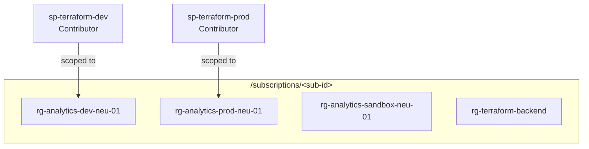
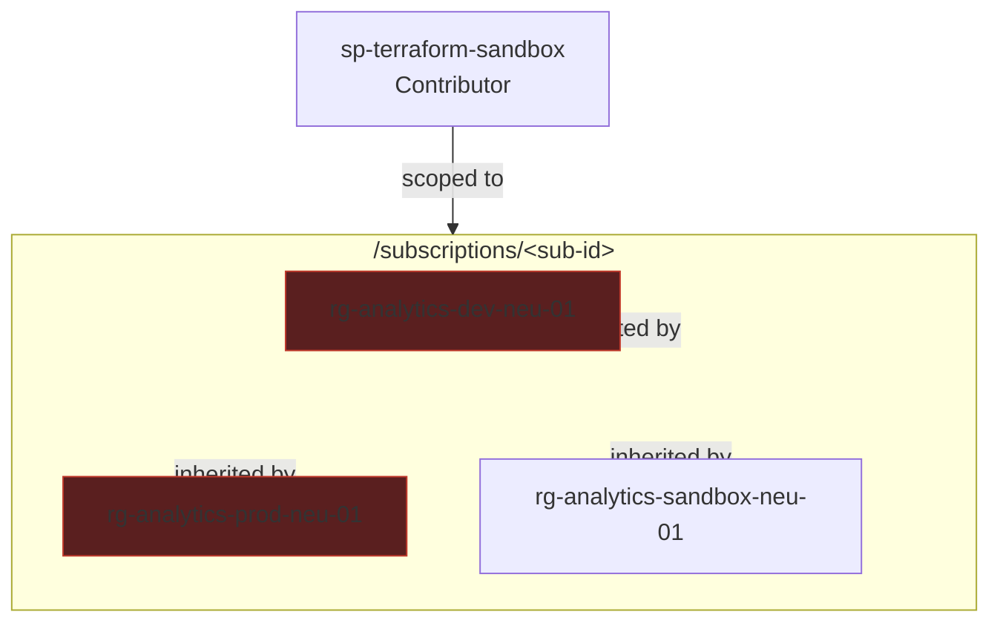
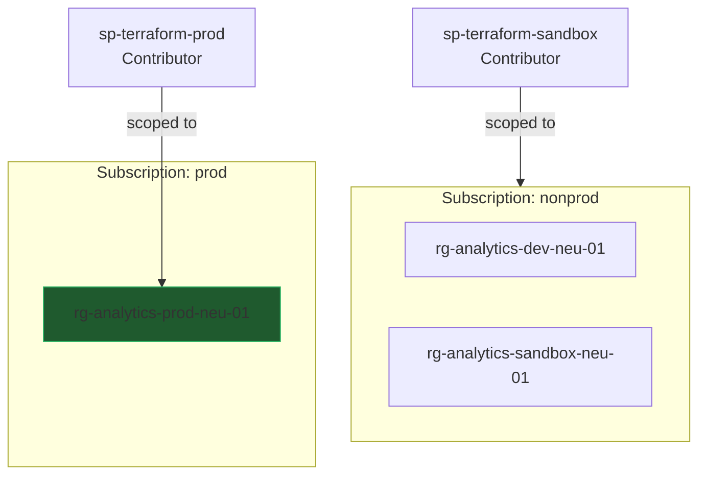

# ADR-0001: `sp-terraform-sandbox` is scoped to the whole subscription

## Status

Accepted (with a known, documented weakness — see Consequences).

## Context

`sandbox/` (a top-level sibling of `environments/`, not nested inside it —
deliberately, so the directory tree itself signals this isn't a real data
environment) exists to let risky Terraform changes — anything that
forces a resource to be destroyed and recreated (`ForceNew` attributes like
`is_hns_enabled`), new resource types, RBAC/networking changes — be verified
against real Azure before touching `dev` or `prod`, which are real,
long-lived, Unity-Catalog-facing environments that must not be used as
disposable test targets.

**What this guarantee actually covers, and what it doesn't:** because
sandbox is destroyed and rebuilt from empty on every run, it can only ever
prove things that don't depend on accumulated history — does Azure's real
API accept this configuration, does the CI identity's RBAC actually suffice,
does a brand-new resource type wire up at all. It cannot prove a change is
safe against `dev`/`prod`'s *actual* accumulated state — existing data,
downstream consumers (a Databricks job or Unity Catalog external location
pointing at a specific storage account), or drift picked up outside
Terraform. That gap widens, not narrows, as dev/prod accumulate more real
usage over time; sandbox's usefulness is front-loaded, not something that
"grows up" alongside the real environments. Treat a clean sandbox run as
"this can exist and this identity can create it," never as "this is safe to
apply for real."

For sandbox to actually be disposable, its `azurerm_resource_group.analytics`
resource must be freely creatable **and destroyable** by its CI identity on
every run — that's the whole point of it being throwaway infrastructure.

`dev` and `prod`'s identities (`sp-terraform-dev`, `sp-terraform-prod`) are
each scoped to exactly one pre-existing resource group:

That pattern doesn't work for sandbox: **creating a resource group is an
operation defined at the subscription scope**, not at the (not-yet-existing)
resource group's own scope. A role assignment can only be attached to a
scope that already exists — so an identity that must be able to *create* a
new RG by name has no narrower place to hold that permission than the
subscription itself.

Azure RBAC scope is also hierarchical: anything granted at the subscription
level automatically applies to every resource group beneath it, with no way
to carve out exceptions using built-in roles alone.

## Decision

Grant `sp-terraform-sandbox` **Contributor at the subscription scope**,
rather than pre-creating `rg-analytics-sandbox-neu-01` once and scoping to
it (which was the alternative considered — see below).

### Alternative considered and rejected (for now)

Pre-create `rg-analytics-sandbox-neu-01` once by hand, `terraform import` it
(the same pattern already used for prod's RG — see
`docs/azure-setup-commands.sh` step 6), and scope `sp-terraform-sandbox`'s
Contributor role to just that RG. This keeps the narrow, dev/prod-style
blast radius, at the cost of sandbox no longer being able to destroy its own
resource group in CI — only the resources inside it. Rejected because it
weakens the property that made sandbox worth building: a fully disposable
environment.

## Consequences

**Accepted risk:** `sp-terraform-sandbox` can currently create, modify, or
delete resources in `rg-analytics-dev-neu-01` and `rg-analytics-prod-neu-01`
— not because the sandbox GitHub Actions job does this today (it only ever
targets `sandbox/`), but because Azure enforces access by role assignment,
not by what a workflow file currently happens to do. A bug in the workflow,
a leaked/misused credential, or a hand-edited `sandbox/main.tf` pointing at
another environment's resources would all be able to reach dev/prod for real.

**Mitigation in place:** the `sandbox` job only runs on manual
`workflow_dispatch`, never automatically on push/PR — reducing exposure
window, not the underlying permission.

**The real fix requires leaving this subscription's boundary:**

Splitting `dev`/`sandbox` into one subscription and `prod` into another
would make prod's isolation a structural property of Azure's subscription
boundary (billing, policy, and RBAC all separate) rather than something that
depends on a role assignment being scoped correctly. `sp-terraform-sandbox`
could then hold subscription-wide Contributor *within the nonprod
subscription only*, solving the original problem (freely creating/destroying
RGs) without any reach into prod at all.

This is currently blocked: the Azure account is on the Free Trial billing
plan, which rejects `az account alias create` (creating an additional
subscription) with `AccountNeedsUpgrade` until upgraded to Pay-As-You-Go.
Revisit this ADR if/when that upgrade happens.

**Until then:** treat `sp-terraform-sandbox`'s credentials with the same
care as `sp-terraform-prod`'s — despite the name, "sandbox" does not mean
"low stakes" for this specific identity.
