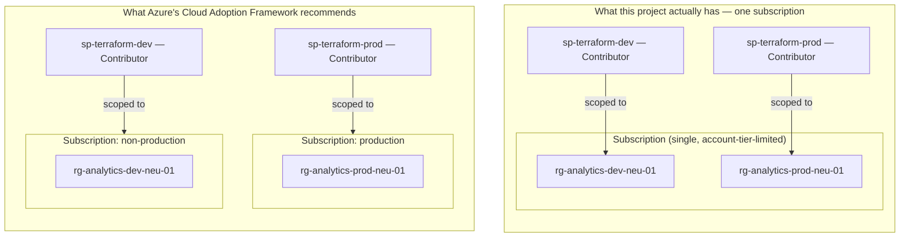

# Architecture — Retail Sales Analytics Platform

Target Azure/Databricks/Terraform architecture that satisfies
[PRD.md](PRD.md)'s business requirements. This is a **future-phase**
design — it builds on top of, and must not duplicate or contradict, the
infrastructure already implemented and documented in
[`../ARCHITECTURE.md`](../ARCHITECTURE.md) and
[`../adr/0002-pipeline-and-identity-architecture.md`](../adr/0002-pipeline-and-identity-architecture.md)
(the currently-real `analytics_group` + `budget_alert` modules, per-environment
OIDC identity, and the plan/apply CI/CD pipeline).

**Scope boundary:** this document covers infrastructure only — the Azure
and Databricks resources that must exist for a sales analytics pipeline to
be *buildable* later. It deliberately excludes anything that is a
data-pipeline/transformation design decision (schema design, how change
over time is captured within a table, data-quality rules, orchestration).
Those belong to whoever implements the actual pipeline, out of scope per
[PRD.md §5](PRD.md).

Each decision below follows the same Context/Decision/Consequences format
as `../adr/0001-*` and `../adr/0002-*`, kept inline in this one document
rather than as separate numbered ADR files, since these are future-phase
design calls rather than decisions already acted on. Resource names and
arguments below are taken from the current `hashicorp/azurerm` and
`databricks/databricks` Terraform provider documentation — see
[IMPLEMENTATION.md](IMPLEMENTATION.md) for the full HCL.

---

## Azure resource architecture

**Context.** The existing foundation gives each environment its own
resource group — `rg-analytics-dev-neu-01`, `rg-analytics-prod-neu-01` —
inside a **single Azure subscription**. This project adds one business
case (Sales) to each environment's resource group, not a second one.

**Decision.** The Databricks workspace, its access connector, and the new
storage containers all live inside each environment's *existing* resource
group — no second resource group per environment.

**Consequences.** Isolation between `dev` and `prod` is enforced by
**Azure RBAC role-assignment scope**: `sp-terraform-dev` and
`sp-terraform-prod` are each granted the `Contributor` role scoped to
exactly one resource group — `sp-terraform-dev` cannot touch
`rg-analytics-prod-neu-01` at all, because its role assignment simply
doesn't exist at that scope. This is a real, enforced boundary, but it is
a **narrower** form of isolation than Azure's own official guidance
recommends for production workloads — see below for why that's the
deliberate tradeoff here, not an oversight.

---

## Environment isolation: resource group vs. subscription boundary

**Context.** Microsoft's own Cloud Adoption Framework (CAF) — the
official guidance for structuring Azure environments — recommends
**separate subscriptions per environment class** (production,
non-production, sandbox), not resource groups within one shared
subscription. A subscription boundary is stronger than an RBAC role
assignment: it carries its own billing, its own Azure Policy scope, and
its own management-group placement, none of which a resource-group-level
split provides. CAF explicitly frames resource groups as a tool for
grouping resources that *share a lifecycle within one environment*
(e.g. "this storage account and this workspace get deleted together"),
not as the tool for separating environments from each other.

This project runs on a single Azure subscription — a constraint of the
account tier this project is built on (a Microsoft Customer Agreement
account limited to one subscription; Azure's Free Trial tier has the
same limitation and additionally rejects creating a second subscription
outright until upgraded to Pay-As-You-Go). There is currently no second
subscription to put `prod` in, so the CAF-recommended structure below
isn't available as-is:



**Decision.** Accept resource-group-scoped RBAC as the isolation boundary
for now, documented explicitly as a deviation from CAF rather than
presented as equivalent to it. Each environment's Service Principal is
scoped narrowly — one RG each, not the whole subscription — to keep the
isolation as strong as a single subscription allows.

**Consequences.** `dev` and `prod` share billing, Azure Policy scope, and
management-group placement — a subscription-level outage, policy
change, or quota exhaustion affects both. The failure mode this
protects against (an identity or workflow bug reaching across
environments) is still caught, since it depends on RBAC role-assignment
scope, which is enforced the same way regardless of subscription
structure — but the failure modes it does **not** protect against
(cost/quota interference, a subscription-wide policy applied
unintentionally) would require the CAF-recommended subscription split to
close. Revisit this decision if/when the account moves off a
single-subscription tier — at that point, splitting `prod` into its own
subscription is a configuration change (a new backend key, a new
provider block pointed at a new subscription ID), not a redesign.

---

## Storage architecture: `azurerm_storage_account` containers

**Context.** Each environment's existing ADLS Gen2 storage account
(`modules/analytics`) needs somewhere to land sales data at
different processing stages.

**Decision.** One `azurerm_storage_container` per environment on the
existing account (hierarchical namespace is already enabled, so this
behaves as an ADLS Gen2 directory, not a flat blob container) — `bronze`
only. `silver`/`gold` have no container: they're Unity Catalog managed
schemas instead, not external locations (see "Unity Catalog: metastore,
catalog, and schema strategy" below for why).

```hcl
resource "azurerm_storage_container" "bronze" {
  name                  = "bronze"
  storage_account_id    = azurerm_storage_account.analytics.id
  container_access_type = "private"
}
```

**Consequences.** No new storage account is created — this reuses the
account `modules/analytics` already provisions, consistent with
PRD §13's "no unnecessary coupling" and the existing account's global name
already being a scarce, hard-won resource (see `../ARCHITECTURE.md` §2 on
the `stanalyticsprodneu01b` naming collision).

---

## Analytical data layering

**Context.** [PRD.md §8](PRD.md#8-analytical-data-organization) requires
raw → intermediate → business-ready staging, without prescribing the
mechanism, and explicitly excludes how transformations or historical
change are implemented (that's pipeline logic).

**Decision.** Medallion layering as a **storage and catalog structure
only** — `bronze`/`silver`/`gold` Unity Catalog schemas (below), backed by
a container only for `bronze` (above); `silver`/`gold` are UC-managed, no
container of their own. What actually writes data into each layer, and
how, is out of scope here.

**Consequences.** This is purely a storage/metadata-organization decision.
No transformation logic, schema-on-write validation, or data-quality
tooling is implied or required by this infrastructure.

---

## Data retention and lifecycle policy

**Context.** [PRD.md §9](PRD.md#9-historical-data-retention) sets an
explicit business requirement: five years of retention, with older data
allowed to sit in a cheaper storage tier before that point. This is the
one PRD requirement that maps directly onto a concrete Azure resource
rather than a design decision left to a future pipeline.

**Decision.** One `azurerm_storage_management_policy` per environment's
storage account, with a lifecycle rule scoped to the raw **landing**
containers (`landing-pos/`, `landing-ecommerce/`) — not `bronze`. Bronze
holds real Delta tables (see "Ingestion catalog: bronze isn't
domain-owned" above); an Azure blob-lifecycle rule has no awareness of the
Delta transaction log, so tiering or deleting individual blobs there by
age alone can silently corrupt a Delta table — it can move or delete data
files the log still references (active data, or files still inside
Delta's own time-travel/`VACUUM` retention window). Landing holds plain,
immutable, source-system-written files that Databricks never writes to
(see "Unity Catalog: external locations" below) — nothing depends on a
specific blob staying put once Auto Loader has read it, so a blob-age
policy is safe there in a way it isn't for bronze:

```hcl
resource "azurerm_storage_management_policy" "default_retention_policy" {
  storage_account_id = azurerm_storage_account.analytics.id

  rule {
    name    = "landing-retention"
    enabled = true

    filters {
      prefix_match = ["landing-pos/", "landing-ecommerce/"]
      blob_types   = ["blockBlob"]
    }

    actions {
      base_blob {
        tier_to_cool_after_days_since_modification_greater_than    = 90
        tier_to_archive_after_days_since_modification_greater_than = 365
        delete_after_days_since_modification_greater_than          = 1825 # 5 years
      }
    }
  }
}
```

**Consequences.** This only covers the raw-file half of PRD §9. It does
**not** by itself satisfy the "remain queryable at lower cost" half for
bronze/silver's own Delta data — that needs a Delta-native mechanism
(`VACUUM` / `delta.deletedFileRetentionDuration`, or a partition-based
archival job), which is pipeline work that doesn't exist yet (see
BACKLOG.md). `silver`/`gold` have no equivalent rule and don't need one
either way — they're Unity Catalog managed schemas with no container of
their own (see "Unity Catalog: metastore, catalog, and schema strategy"
below), so there's no blob-level lifecycle to configure at all;
retention/cleanup for all derived Delta data (bronze included) is a
UC/pipeline-level concern, not an Azure storage policy.

---

## Databricks workspace architecture

**Context.** PRD requires Databricks as the analytical compute platform
(§14), with no networking requirement yet (§16 backlog).

**Decision.** One `azurerm_databricks_workspace` per environment, `sku =
"standard"` (no need for `premium`-only features like
`infrastructure_encryption_enabled` at this phase), default
`public_network_access_enabled = true` (VNet injection via
`custom_parameters` is deliberately not configured — see "Networking,
deferred" below):

```hcl
resource "azurerm_databricks_workspace" "this" {
  name                = "dbw-analytics-${var.environment}-neu-01"
  resource_group_name = azurerm_resource_group.analytics.name
  location             = var.location
  sku                  = "premium" # Unity Catalog requires it -- see BACKLOG.md's "Checked and ruled out" note
}
```

**Consequences.** Azure Databricks creates its own *managed* resource
group (`managed_resource_group_name`, auto-named unless set explicitly) to
hold cluster-support infrastructure it controls directly — that managed RG
is outside this project's Terraform state and RBAC model by design; it's
Databricks' own operational concern, not this platform's.

---

## Unity Catalog: storage access (`azurerm_databricks_access_connector` + `databricks_storage_credential`)

**Context.** Unity Catalog needs a credential to read/write the ADLS Gen2
containers above. PRD §11 requires least-privilege, identity-based access
over static credentials.

**Decision.** An Azure Databricks Access Connector (a managed identity
purpose-built for this) per environment, granted `Storage Blob Data
Contributor` on the storage account, referenced by a
`databricks_storage_credential` using its `azure_managed_identity` block
— **not** `azure_service_principal`, which requires a long-lived client
secret and is the legacy pattern the current provider docs advise against:

```hcl
resource "azurerm_databricks_access_connector" "sales" {
  name                = "dbac-analytics-${var.environment}-neu-01"
  resource_group_name = azurerm_resource_group.analytics.name
  location             = var.location
  identity {
    type = "SystemAssigned"
  }
}

resource "databricks_storage_credential" "analytics" {
  name = "cred-analytics-${var.environment}"
  azure_managed_identity {
    access_connector_id = azurerm_databricks_access_connector.sales.id
  }
}
```

One credential per environment, not per domain — the access connector's
managed identity already has `Storage Blob Data Contributor` across the
whole storage account, not scoped to any one domain's containers, so
declaring a second credential per domain would just be a second wrapper
around the identical identity. Every domain's own `managed` external
location (below) and `ingestion_<env>`'s own reference this same
credential by name (`modules/databricks/storage`'s output).

**Consequences.** No Databricks-side secret to rotate or leak — the trust
relationship is an Azure-native managed identity + RBAC role assignment,
the same pattern this repo already uses for CI/CD (`../adr/0002-*`), just
applied to Unity Catalog's own storage access instead of Terraform's.

---

## Secrets: identity-based by default, Key-Vault-backed as the fallback

**Context.** PRD §11: "Secrets that cannot be eliminated through
identity-based authentication should be securely managed." Every
credential in this design so far — CI/CD (`../adr/0002-*`'s OIDC
federated credential), Unity Catalog's storage access (decision above),
and interactive login (Entra ID directly) — is identity-based with no
standing secret to manage. That makes this requirement currently
satisfied vacuously, which is worth stating explicitly rather than
leaving silent, since "no decision made" and "confirmed not needed yet"
read identically from the architecture alone.

**Decision.** If a genuine secret ever becomes unavoidable (a future
pipeline needing a third-party API key with no managed-identity-based
auth option, for example), it goes in a `databricks_secret_scope` backed
by Azure Key Vault (`keyvault_metadata` block, referencing a Key Vault
already provisioned by `azurerm_key_vault`), not a Databricks-native
secret scope:

```hcl
resource "databricks_secret_scope" "sales" {
  name = "sales-${var.environment}"

  keyvault_metadata {
    resource_id = azurerm_key_vault.sales.id
    dns_name    = azurerm_key_vault.sales.vault_uri
  }
}
```

**Consequences.** One secret store (Key Vault) instead of two — the
Databricks-native secret scope backend would mean Azure RBAC/Key Vault
access policies and Databricks' own `databricks_secret_acl` become two
independent permission systems to keep in sync for the same secret. Not
built now — no concrete secret exists yet to justify it — but the
mechanism is decided in advance so the first real need doesn't also
become an architecture debate.

---

## Unity Catalog: external locations

**Context.** Unity Catalog requires each storage path it manages to be
explicitly registered, rather than trusting any path the credential above
could technically reach.

**Decision.** External locations exist for exactly two kinds of thing, not
one per medallion layer:

1. **Genuine raw file access** — the raw `bronze` container and the two
   source-system landing containers (`pos_landing`/`ecommerce_landing`),
   all environment-wide (`modules/databricks/storage`, not
   per-domain — see "Ingestion catalog: bronze isn't domain-owned" above).
   These need direct blob-level access (file-event ingestion triggers,
   the retention policy above), which is exactly what an external
   location is for.
2. **Each catalog's own managed storage root** — even a `MANAGED` schema
   with no `storage_root` of its own still resolves to *some* physical
   path, one level up (its catalog's `storage_root`), and Unity Catalog
   rejects a catalog `storage_root` that isn't covered by a registered
   external location — found by hand, in practice: catalog creation
   failed outright with `External Location '...' does not exist` before
   this was added. So every domain catalog (`sales_dev`, `marketing_dev`,
   ...) and the `ingestion_<env>` catalog each get their own `"managed"`
   external location, even though nothing inside them is itself an
   external table — "managed" only changes what happens *below* that
   root (Unity Catalog owns the internal layout), not whether the root
   itself needs registering.

`silver`/`gold`, and each domain's own `bronze` schema, have **no
external location of their own** — they inherit their catalog's managed
root (category 2 above), which is the only registration they need.

```hcl
resource "databricks_external_location" "bronze" {
  name            = "loc-analytics-${var.environment}-bronze"
  url             = "abfss://bronze@${azurerm_storage_account.analytics.name}.dfs.core.windows.net/"
  credential_name = databricks_storage_credential.analytics.id
}

# One of these per catalog -- domain catalogs AND the non-domain
# ingestion catalog each need their own (category 2 above).
resource "databricks_external_location" "managed" {
  name            = "loc-analytics-${var.environment}-${var.domain}-managed"
  url             = "abfss://managed-${var.domain}@${azurerm_storage_account.analytics.name}.dfs.core.windows.net/"
  credential_name = databricks_storage_credential.analytics.id
}
```

**Consequences.** Even though the storage credential *could* reach any
container on the account, Unity Catalog only allows managed access through
registered external locations — an extra layer of least-privilege beyond
the Azure RBAC role assignment. `silver`/`gold` (and each domain's own
`bronze`) get a stronger version of this same property: with no external
location covering anything but their catalog's own managed root, the
*only* way to reach their data is through Unity Catalog itself — there's
no parallel Azure-RBAC-on-a-container path scoped narrowly enough to
bypass UC grants for just that schema.

---

## Unity Catalog: metastore, catalog, and schema strategy

**Context.** A Unity Catalog **metastore** is an *account-level* object in
Databricks — one per region, shared across every workspace in that region,
not something created per environment or per workspace. This is the same
bootstrap-circularity shape the existing App Registration setup already
has (`../adr/0002-*`): an account-level object can't reasonably be created
by a per-environment CI/CD pipeline run.

**Decision.**

- **Metastore** — one, created once by hand (see
  [IMPLEMENTATION.md §Bootstrap](IMPLEMENTATION.md#bootstrap)), assigned to
  each workspace via `databricks_metastore_assignment`.
- **Catalog** — one per *domain, per environment*, not one per medallion
  layer: `sales_dev`/`sales_prod` and (as of the first real second domain)
  `marketing_dev`/`marketing_prod` today. Environment isolation still
  lives at the catalog level (PRD §10: "a change or failure in Development
  must not unintentionally affect Production") — a `dev`-scoped identity
  has no catalog-level path to `prod` data even if it somehow reached the
  `prod` workspace. `modules/databricks/unity_catalog` takes `domain` as a
  required input (no default) specifically so a second business domain
  gets its own catalog just by calling the module again with a different
  domain — no rename of the first domain's already-applied catalog
  required. This is the catalog-per-business-domain shape from
  Databricks' own functional-workspace-organization guidance, not
  something invented here.
- **Schema** — `silver` and `gold` inside each domain's catalog, both
  Unity Catalog `MANAGED` (no `storage_root`). There is deliberately no
  `bronze` schema per domain: raw bronze lives once, in the non-domain
  `ingestion_<env>` catalog, and each domain builds its silver from it —
  see "Ingestion catalog: bronze isn't domain-owned" further down.

```hcl
resource "databricks_catalog" "this" {
  name         = "${var.domain}_${var.environment}" # "sales_dev", "marketing_dev", ...
  metastore_id = var.metastore_id
  comment      = "${var.domain} analytics catalog — ${var.environment}"
}

resource "databricks_schema" "silver" {
  catalog_name = databricks_catalog.this.name
  name         = "silver"
  # No storage_root -- managed by Unity Catalog under the catalog's own
  # managed storage location.
}
# "gold" follows the same managed shape as "silver"
```

**Consequences.** Querying is always `sales_dev.silver.*` /
`sales_prod.gold.*` (or `marketing_dev.*`, ...) — domain, environment, and
layer are all explicit in every fully-qualified table name, with no risk
of a `dev` query accidentally resolving against `prod` data, and no
naming collision as a real second domain gets added.

---

## Ingestion catalog: bronze isn't domain-owned

**Context.** An earlier version of this design put a `bronze` schema
inside each domain's own catalog, pointing its `storage_root` directly at
the raw POS/e-commerce landing containers (the same shape "Unity Catalog:
external locations" above still describes for how those containers get
registered). That held up with one domain. The moment a real second
domain (`marketing`) called the same module, it broke: `bronze` was never
actually domain-specific data — a raw file lands because of *which source
system* produced it, not because of which business domain will eventually
own it — so `sales_dev.bronze` and `marketing_dev.bronze` ended up as two
separate Unity Catalog schema objects, both registered against the
*identical* physical raw-landing container. Unity Catalog doesn't reject
that outright (nothing stops two schemas pointing at the same external
location's URL), but it's a real correctness problem: two domains'
`bronze` schemas silently sharing one underlying set of files, with no
Unity-Catalog-enforced boundary between them at all.

**Decision.** Split "bronze" into two different things that happen to
share a schema name:

- **Raw ingestion bronze** — `ingestion_<env>.bronze`, in a new,
  non-domain catalog (`databricks_catalog.ingestion`,
  `modules/databricks/storage`), owned by
  `grp-databricks-platform-<env>` like the rest of that environment-wide
  infrastructure. This is where `pos_landing`/`ecommerce_landing`
  (external volumes) and their checkpoint volumes actually live, and it's
  registered against the real raw landing containers exactly once,
  regardless of how many business domains eventually exist.
- **No per-domain bronze.** A domain-level `bronze` schema was tried
  (MANAGED, meant to hold domain-curated raw) and removed: the flow is
  landing → `ingestion_<env>.bronze` → domain silver, so routing a record
  to a domain happens when that domain builds its silver, and a per-domain
  bronze would only hold a second copy of raw data. Databricks' medallion
  guidance describes bronze as the single source of truth for raw data,
  and silver as built from "one or more bronze or silver tables".

A domain that needs to read the raw feed gets an explicit grant on
`ingestion_<env>.bronze` (`bronze_consumer_group_name` in
`modules/databricks/storage`, currently
`grp-sales-data-engineers-<env>` only — no second domain has a real,
PRD-backed need for it yet) — the same way any other cross-catalog read
works in Unity Catalog, no special mechanism.

**Consequences.** `bronze` has one meaning again: `ingestion_<env>.bronze`.
Domain catalogs only have `silver`/`gold`, and read raw data through the
explicit grant above. The alternative — one shared `bronze` schema
location referenced by every domain's catalog directly — was rejected
because it reintroduces the overlap problem this decision exists to fix.

---

## Catalog isolation: workspace-catalog bindings

**Context.** A Unity Catalog catalog's default `isolation_mode` is
`OPEN` — visible and queryable from *every* workspace attached to its
metastore, not just the one it's conceptually "for." Since `dev` and
`prod` share one metastore per region by design (decision above), an
`OPEN` `dev` catalog is, by default, also reachable from the `prod`
workspace, and vice versa. The environment isolation claimed above ("a
`dev`-scoped identity has no catalog-level path to `prod` data") is only
actually true once this is configured — left at the default, it would
rest entirely on every Unity Catalog grant being correct forever, the
same purely-logical, no-independent-backstop boundary already rejected as
insufficient on its own for the resource-group-level Azure RBAC decision
above.

**Decision.** Each catalog is created with `isolation_mode = "ISOLATED"`,
paired with exactly one `databricks_workspace_binding` tying it to its
own environment's workspace only:

```hcl
resource "databricks_catalog" "this" {
  name           = "${var.domain}_${var.environment}"
  metastore_id   = var.metastore_id
  isolation_mode = "ISOLATED"
}

resource "databricks_workspace_binding" "this" {
  securable_name = databricks_catalog.this.name
  workspace_id   = var.workspace_id # this environment's own workspace
}
```

**Consequences.** A `dev`-scoped identity now has no catalog-level path
to `prod` data even if every Unity Catalog grant were somehow
misconfigured to allow it — the `prod` workspace structurally cannot
resolve the `dev` catalog (and vice versa), independent of grants. This
is the same defense-in-depth reasoning as the Azure RBAC resource-group
boundary above, applied one layer up the stack: two independent controls
(RBAC at the infrastructure layer, workspace binding at the catalog
layer) rather than one shared point of failure.

---

## Metastore's own Azure resources: dedicated resource group

**Context.** The metastore needs its own root storage — an ADLS Gen2
storage account, plus an Access Connector/storage credential pair so
Unity Catalog can authenticate to it — distinct from either environment's
own medallion storage (`stanalytics<env><region><instance>`). Because the
metastore itself is account-level and shared across `dev` and `prod` (see
above), the resources backing *it* can't live inside either environment's
resource group without making the shared metastore's storage silently
depend on one specific environment's lifecycle.

This mirrors a placement question the existing foundation already solved:
`rg-terraform-backend` (Terraform state storage) is kept outside both
`environments/dev` and `environments/prod`'s resource groups for the same
reason — it's infrastructure both environments depend on, not
infrastructure either one of them owns.

A related pitfall worth naming explicitly, found by direct trial rather
than documentation: an Azure Databricks workspace's own *managed*
resource group (`databricks-rg-...`, auto-created by the
`Microsoft.Databricks` resource provider alongside every workspace) also
contains an Access Connector Databricks provisions automatically
(`unity-catalog-access-connector`), pre-staged for its own automatic
Unity Catalog enablement flow. It's tempting to reuse it for the
metastore's storage credential since it's already there — don't. It
inherits the lifecycle of whichever single workspace's managed resource
group it happens to live in; destroying and recreating that one workspace
would take the shared metastore's storage credential down with it, even
though the metastore is meant to outlive any single workspace.

**Decision.** A dedicated resource group, `rg-databricks-metastore-<region>-<instance>`
(e.g. `rg-databricks-metastore-neu-01`) — a sibling to
`rg-analytics-dev-neu-01`/`rg-analytics-prod-neu-01`, owned by neither —
holding exactly two resources, bootstrapped once per region alongside the
metastore itself (see [IMPLEMENTATION.md §Bootstrap](IMPLEMENTATION.md#bootstrap)):

- `stucmetastore<region><instance>` — the metastore's ADLS Gen2 root
  storage account.
- `dbac-uc-metastore-<region>-<instance>` — the Access Connector granted
  `Storage Blob Data Contributor` on that storage account, wired to the
  metastore's root storage via a `databricks_storage_credential`.

**Consequences.** The metastore's storage credential now has a lifecycle
independent of any single workspace — deleting and recreating
`dbw-analytics-dev-neu-01` (or a future `dbw-analytics-prod-neu-01`)
cannot take the metastore's own storage access down with it. The
auto-created `unity-catalog-access-connector` inside each workspace's
managed resource group is left unused, confirmed to hold zero role
assignments, and **cannot be deleted at all** — Azure Databricks places a
system Deny Assignment on the entire managed resource group, which
overrides any Allow role assignment, even Owner (`az databricks
access-connector delete` confirmed this directly: `DenyAssignmentAuthorizationFailed`,
citing a `System deny assignment created by Azure Databricks` at the
managed RG's scope). Not a permissions gap to work around — this is
intentional: nobody can modify a Databricks-managed resource group
through Azure directly, only Databricks' own control plane can, for as
long as the workspace exists. Harmless and permanent, not a cleanup
task.

**Ownership note — groups throughout, SPs kept for authentication only.**
Databricks' own Unity Catalog best-practices guidance says to assign
ownership to groups rather than individuals. An earlier version of this
design used service principals as owner instead
(`sp-databricks-account-admin` on the metastore,
`sp-terraform-<env>` on the per-environment storage credential),
reasoning that an SP avoids the same succession risk a named person
would carry. That conflated two different roles: an SP is the right
identity to *authenticate* Terraform's applies (an automation identity,
not a person — see IMPLEMENTATION.md's Bootstrap section and
`docs/azure-setup-commands.sh`), but `owner` is a separate,
administrative/accountability role — who can grant/revoke, reassign, or
drop the object outside Terraform, and who audit trails point to. A
group protects against the same succession risk (no single person to
lose) without collapsing those two roles into one identity.

Every Unity-Catalog-level ownable object in this project is therefore
group-owned:

| Object | Owner |
|---|---|
| `databricks_metastore.primary` | `grp-databricks-account-admins` — account-level, one group, not per-environment (one metastore, shared) |
| `databricks_storage_credential.analytics`, the bronze/landing external locations, and `databricks_catalog.ingestion` and its own `bronze` schema (per environment, `modules/databricks/storage`) | `grp-databricks-platform-<env>` |
| `databricks_catalog.this` and its three schemas, per domain (`modules/databricks/unity_catalog`, called once per domain — `sales_dev`, `marketing_dev`, ...) | `grp-<domain>-data-governance-<env>` (`grp-sales-data-governance-<env>` for the `sales` catalog, etc.) |

The storage credential and bronze/landing external locations moved to a
**different** owner than the catalog/schemas -- `grp-databricks-platform-
<env>`, not `grp-sales-data-governance-<env>` -- once a second business
domain became concrete rather than hypothetical. That credential/those
external locations aren't sales-specific (the access connector's managed
identity already has storage access across the whole account, not scoped
to any one domain's containers); giving a domain's own governance group
ownership of environment-wide infrastructure every other domain also
depends on would put that domain in unaccountable control of a shared
resource. `grp-databricks-platform-<env>` is the environment-wide
counterpart to each domain's own `grp-<domain>-data-governance-<env>`.

`grp-sales-data-governance-<env>` is deliberately separate from
`grp-sales-data-engineers-<env>` — see "Identity model: groups, not
custom roles" below for why those two are kept apart.

---

## Identity model: groups, not custom roles

**Context.** PRD §6 names two distinct stakeholder groups (Sales — read
access for reporting; Data Engineering — builds and operates the platform)
and PRD §11 requires least-privilege, environment-differentiated access.
Unity Catalog has **no first-class "role" object** distinct from a group
(unlike, e.g., Snowflake's `ROLE`) — grants attach directly to a principal,
and a principal is a user, a service principal, or a group. A "custom
role" in Unity Catalog is therefore not a separate resource to create; it
*is* a named group plus the fixed set of grants applied to that group.

**Decision.** Four account-level groups per **domain**, per environment
(`dev`/`prod` never share a group — see "Groups are environment-scoped,"
below), sourced from Entra ID and synced to the Databricks account via
SCIM (group *membership* — who's actually in `grp-sales-analysts-prod` —
is an Entra ID/HR concern, not something Terraform manages; Terraform only
references the group name as a grant principal, the same externally-
bootstrapped-identity pattern already used for `sp-terraform-*`). Sales
was the only domain when this decision was first written (four groups,
eight total); a real second domain (`marketing`) now exists too, with its
own four groups (`grp-marketing-*`, currently created in Entra ID but not
yet registered at the Databricks account level — see `BACKLOG.md`'s
group-provisioning table), following the exact same shape:

| Group | Represents (PRD §6, generalized per-domain) | Layers | Privileges |
|---|---|---|---|
| `grp-<domain>-stakeholders-<env>` | Report consumers for that domain (Sales, per PRD §6) | `gold` only | `USE_CATALOG`, `USE_SCHEMA`, `SELECT` |
| `grp-<domain>-analysts-<env>` | Ad hoc/drill-down analysis for that domain | `silver`, `gold` | `USE_CATALOG`, `USE_SCHEMA`, `SELECT` |
| `grp-<domain>-data-engineers-<env>` | Builds/operates that domain's own pipelines | `bronze`, `silver`, `gold` (this domain's own, curated `bronze` — see "Ingestion catalog: bronze isn't domain-owned" above, not the shared raw landing) | `USE_CATALOG`, `USE_SCHEMA`, `SELECT`, `MODIFY` (see below — the metastore's privilege version doesn't support a finer split) |
| `grp-<domain>-data-governance-<env>` | Administrative/governance role, not an operational one — decides who else gets access | n/a (no data-layer grants) | **Owner** of that domain's own catalog and its three schemas |
| `sp-terraform-<env>` (existing) | CI/CD automation, not a human role | all, every domain | `USE_CATALOG`, `USE_SCHEMA`, `CREATE_SCHEMA`, `CREATE_TABLE` (granted per domain catalog) |
| `grp-databricks-ci-<env>` | CI/CD automation's *own* access, not data access — `sp-terraform-<env>` as a member | n/a (no data-layer grants) | Workspace membership + metastore `CREATE_CATALOG`/`CREATE_EXTERNAL_LOCATION`/`CREATE_STORAGE_CREDENTIAL` (`environments/<env>/main.tf`, not this module) |
| `grp-databricks-platform-<env>` | Environment-wide infrastructure governance, not any one domain's own — administers what every domain's catalog depends on | `ingestion_<env>.bronze` (its own, raw) | **Owner** of the storage credential, bronze/landing external locations, and the `ingestion_<env>` catalog (`modules/databricks/storage`) |

`bronze_consumer_group_name` (`modules/databricks/storage`) is
the one exception to "per domain" above — only `grp-sales-data-engineers-
<env>` is granted `READ VOLUME`/`SELECT` on the shared raw
`ingestion_<env>.bronze` today, since no second domain has a real,
PRD-backed need for that raw feed yet. A second domain that genuinely
needed it would get its own grant added by hand, not a list mechanism
built ahead of that need.

`grp-databricks-ci-<env>` is a different kind of group from the four
above it -- it's not PRD-derived data governance, it's the identity
plumbing CI needs to reach a workspace/metastore at all. Granting these
two things (workspace membership, metastore `CREATE_*`) to a group
instead of directly to `sp-terraform-<env>` means a second workspace in
the same environment tier, or a second CI service principal, is an Entra
ID group-membership change and one new `databricks_permission_assignment`
block -- not an edit to every existing grant. See
`environments/dev/main.tf`'s `ci_group` resources for where this is
actually declared (root-module-level, not this module -- it's about
workspace/metastore access, upstream of anything catalog-specific here).

`grp-databricks-platform-<env>` exists for the same underlying reason as
`grp-sales-data-governance-<env>` (separation of duties) but at the
environment layer instead of the domain layer: the storage credential and
bronze/landing external locations back *every* domain's catalog on this
environment's metastore assignment, not just `sales`'s -- see "Ownership
note" above for the full reasoning on why that moved out of
`grp-sales-data-governance-<env>`.

`grp-sales-data-governance-<env>` isn't one of PRD §6's named stakeholder
groups -- it's introduced here for separation of duties. Catalog/schema
`owner` in Unity Catalog is an administrative role (grant/revoke
privileges, rename, drop, transfer ownership), not a data-access grant
like the rows above it. Making `grp-sales-data-engineers-<env>` both the
operator (writes data, runs pipelines) *and* the owner (controls who
else gets access) would let that group grant itself or anyone else
broader access with nobody else in the loop. Splitting the two keeps
"who can touch the data" and "who can change who can touch the data" as
different groups, at the cost of one more group to provision per
environment.

`grp-sales-data-engineers-*` uses blanket `MODIFY`, not the fine-grained
`INSERT`/`UPDATE`/`DELETE` split an earlier version of this grant tried —
that split would have been the more least-privilege choice (a pipeline
identity that only ever appends new bronze data doesn't need delete
rights just because it needs write rights), but `terraform apply` failed
outright: this metastore's own privilege version (`1.0`) doesn't support
those fine-grained DML privileges at the catalog level at all, confirmed
by Databricks' own error message. Revisit if this metastore is ever
upgraded to a privilege version that supports it (see BACKLOG.md).

Stakeholders don't get `bronze`/`silver` access at all — they're raw and
intermediate layers, not meant for direct business consumption; PRD §7's
"analytical datasets should be designed around business questions, not
either source system's schema" is exactly what `gold` exists to provide.
Analysts sit one step wider than stakeholders (add `silver`, for
investigating a number back toward its inputs) but still never touch
`bronze` directly, and never get write access — only
`grp-sales-data-engineers-*` and `sp-terraform-*` write anything.

**Groups are environment-scoped — no group spans `dev` and `prod`.**
`grp-sales-data-engineers-dev` and `grp-sales-data-engineers-prod` are two
separate groups, not one group granted on two catalogs: this is what makes
PRD §11's "Production access should be more restricted than Development
access" an enforceable, differentiated grant instead of a sentence nobody
checks —

**Grant scope is not uniform across these four principals, and that's
deliberate, not an inconsistency.** Unity Catalog privileges inherit
*downward* — a privilege granted at the catalog level applies to every
schema beneath it, present and future. That's exactly right for
`grp-sales-data-engineers-<env>` and `sp-terraform-<env>`, who legitimately
need every layer. It's exactly *wrong* for `grp-sales-stakeholders-<env>`
and `grp-sales-analysts-<env>`, whose entire purpose is to see a **subset**
of layers — a catalog-level grant for them would silently hand out
`bronze`/`silver` access the table above says they shouldn't have. So the
two broad principals get catalog-scoped grants; the two narrow ones get
grants scoped to exactly the schemas they're allowed to see, plus a
catalog-level `USE_CATALOG` (which only lets a principal *address* the
catalog by name — it exposes nothing on its own):

```hcl
resource "databricks_grants" "catalog" {
  catalog = databricks_catalog.this.name # "sales_dev"

  # USE_CATALOG only — lets these two principals reference dev.<schema>.<table>
  # at all; grants no visibility into any schema by itself
  grant {
    principal  = "grp-sales-stakeholders-dev"
    privileges = ["USE_CATALOG"]
  }
  grant {
    principal  = "grp-sales-analysts-dev"
    privileges = ["USE_CATALOG"]
  }

  # Catalog-scoped on purpose — these two need every layer, so inheriting
  # to all current and future schemas is exactly the intended behavior
  grant {
    principal  = "grp-sales-data-engineers-dev"
    privileges = ["USE_CATALOG", "USE_SCHEMA", "SELECT", "MODIFY"]
  }
  grant {
    principal  = "sp-terraform-dev"
    privileges = ["USE_CATALOG", "USE_SCHEMA", "CREATE_SCHEMA", "CREATE_TABLE"]
  }
}

# Layer access for the two narrow-scope groups is granted per schema,
# not inherited from the catalog block above
resource "databricks_grants" "dev_gold_schema" {
  schema = databricks_schema.gold.id

  grant {
    principal  = "grp-sales-stakeholders-dev"
    privileges = ["USE_SCHEMA", "SELECT"]
  }
  grant {
    principal  = "grp-sales-analysts-dev"
    privileges = ["USE_SCHEMA", "SELECT"]
  }
}

resource "databricks_grants" "dev_silver_schema" {
  schema = databricks_schema.silver.id

  grant {
    principal  = "grp-sales-analysts-dev" # stakeholders excluded — gold only
    privileges = ["USE_SCHEMA", "SELECT"]
  }
}
# prod_catalog / prod_gold_schema / prod_silver_schema follow the exact
# same shape as dev's, including grp-sales-data-engineers-prod's grant --
# no dev/prod difference on this one (see "Identity model" above for why).
```

**Consequences.** Downward inheritance is used *selectively*: it's what
makes granting `grp-sales-data-engineers-<env>` and `sp-terraform-<env>`
once at catalog level enough to cover every table a future pipeline
creates, but it's exactly the mechanism that would break the
stakeholder/analyst layer split if applied the same way to them — so
their access is built from schema-level grants instead, and `bronze`
simply never appears in either principal's grant list. A person moving
from Development to a Sales-analyst role in Production is an Entra ID
group-membership change, not a Terraform change — but a person's
*capabilities* differ by environment because the groups themselves, not
just membership, differ. This is the Unity Catalog-level analogue to the
Azure RBAC role assignments `../adr/0002-*` already documents for
Terraform's own Azure access — two independent least-privilege layers,
neither a substitute for the other.

---

## Terraform / Databricks Asset Bundles ownership boundary

**Context.** Databricks Asset Bundles (DABs) are the standard tool for
deploying *workspace* artifacts — jobs, pipelines, notebooks — once a
future phase actually builds the sales pipeline this platform's
infrastructure supports. DABs and Terraform can both technically express
Unity Catalog grants and workspace-object permissions, and `databricks_grants`
is **authoritative**: every Terraform apply overwrites the *entire* grant
set on a securable, silently reverting anything changed out-of-band —
including a grant a DAB `databricks.yml` declared. Separately, `bundle
validate` itself warns when a bundle's own `permissions:` block (which
controls `CAN_MANAGE` on the *job/pipeline object*, not on data — a
different Unity Catalog concept, more workspace-ACL-like) doesn't
explicitly include the deploying identity, since DAB has no visibility
into Terraform-side RBAC and can't reconcile against it. A third
overlap point: DABs also has its own first-class `volumes` resource type
(`resources: volumes:` in `databricks.yml`) — the bronze external volume
this platform needs for Auto Loader/file-arrival ingestion (see "Unity
Catalog: external locations" above) could, in principle, be declared by
either tool.

**Decision.** Three independent surfaces, one owner each, never
overlapping:

- **Unity Catalog data grants** (`databricks_grants` on catalogs, schemas,
  tables) — **Terraform-owned only.** A future pipeline's `databricks.yml`
  must never declare a `grant`/permissions block targeting a catalog or
  schema this repo already provisions.
- **Shared Unity Catalog objects that wrap infrastructure this repo
  provisions** — catalogs, schemas, external locations, and the
  source-system landing volumes (`pos_landing`/`ecommerce_landing`, and
  now also their Auto Loader checkpoint volumes,
  `pos_landing_checkpoint`/`ecommerce_landing_checkpoint` — see
  `modules/databricks/storage`) — **Terraform-owned only**, the
  same rule as grants, for the same reason: these sit directly on top of
  the storage account/containers Terraform already creates, and any
  future pipeline needs to reference *the same* volume by name rather
  than each defining its own competing copy. A future `databricks.yml`
  references `pos_landing`, `pos_landing_checkpoint`, etc. as
  already-existing volumes, never declares its own `resources: volumes:`
  entry for any of them. (Checkpoint volumes moved into this
  Terraform-owned category deliberately, not automatically — Databricks'
  own Auto Loader/Unity Catalog guidance recommends checkpoint state live
  in UC-managed storage rather than as pipeline-scratch state, which put
  it on the "shared, foundational" side of the test below rather than the
  "specific to one pipeline's own implementation" side a first read might
  assume.)
- **Workspace object permissions** (who can view/run/manage a specific
  job or pipeline — DAB's own `permissions:` block, or the Terraform
  `databricks_permissions` resource) — **DAB-owned**, since that's scoped
  to artifacts DABs itself deploys; Terraform never creates jobs/pipelines
  in this design, so there's nothing for it to compete over here.

**Consequences.** The dividing line in every case is the same test: an
object is Terraform's if it's shared, foundational, and would need to
outlive or be referenced by more than one future pipeline; it's DAB's if
it's specific to one pipeline's own implementation (its jobs, its
notebooks, any genuinely scratch/temp working volume a pipeline creates
purely for its own intermediate state — as distinct from the shared
landing and checkpoint volumes above, which are Terraform's precisely
because they're not scratch: the checkpoint volumes hold durable
streaming state Databricks recommends keeping in UC-managed storage, not
disposable working data). When
the pipeline phase starts, its `databricks.yml` should reference this
platform's catalogs/schemas/volumes by **name only** (as objects that
already exist, created by this repo) and must not attempt to declare,
grant, or revoke anything on them — and its own `permissions:` block
should explicitly list the deploying identity (its own CI/CD service
principal, likely a *different* SP than `sp-terraform-*`, scoped to the
workspace rather than to Azure resources) to avoid exactly the `bundle
validate` warning this decision was prompted by.

---

## CI/CD architecture

**Context.** The existing pipeline (`../ARCHITECTURE.md` §3,
`../adr/0002-*`) already implements: `fmt-check` → `plan-dev` (PR comment)
→ `apply-dev` (auto, on merge) → `plan-prod` → `apply-prod` (gated by the
`production` GitHub Environment's required reviewer).

**Decision.** All resources above are added as new `module` blocks inside
the *existing* `environments/dev`/`environments/prod` root modules (see
[IMPLEMENTATION.md](IMPLEMENTATION.md)) — no new jobs, no new gates. The
`databricks` provider's own authentication (see
[IMPLEMENTATION.md](IMPLEMENTATION.md)) reuses each root's existing OIDC
identity wherever the provider supports it.

**Consequences.** The existing destructive-change detection
(`../adr/0002-*`, "Destructive change detection") applies to every
resource above exactly as it does to storage/budget resources today.

---

## Networking — deferred to backlog

**Context.** [PRD.md §5 / §16](PRD.md) explicitly place detailed network
architecture out of scope unless required to provision the initial
platform.

**Decision.** No private endpoints, no VNet injection via
`azurerm_databricks_workspace`'s `custom_parameters` block, no network
security groups. The workspace and storage account remain on their default
public-network configuration, matching the existing storage account's
current configuration.

**Consequences.** Explicit, documented gap, not an oversight — revisit if a
real networking requirement emerges (compliance, private connectivity to
on-prem systems), at which point it becomes its own ADR given the scope of
change involved.

---

## Reproducibility summary

```text
                Version Control
                       │
                       ▼
                    Terraform
                       │
              ┌────────┴────────┐
              ▼                 ▼
             DEV               PROD
              │                 │
   rg-analytics-dev-neu-01   rg-analytics-prod-neu-01
              │                 │
      Databricks workspace  Databricks workspace
      + access connector    + access connector
              │                 │
   ┌──────────┼──────────┐         (same shape, "-prod")
   ▼          ▼          ▼
catalog:   catalog:    catalog:
sales_dev  marketing_  ingestion_dev
(own       dev         (own managed
managed    (own        container;
container; managed     bronze schema
bronze/    container)  -- own container,
silver/                NOT managed --
gold, all              + landing-pos/
UC managed,             landing-
no container            ecommerce
of their own            volumes,
except                  EXTERNAL,
bronze)                 read_only)
   │          │              │
   └──────────┴──────┬───────┘
                      ▼
         landing-pos/ + landing-ecommerce/
         lifecycle: cool@90d, archive@1y,
                     delete@5y
         (bronze itself has NO blob lifecycle --
          Delta-native retention only, see
          "Data retention and lifecycle policy")
```

Nothing here introduces a new Terraform root, a new backend, or a new
CI/CD job — the reproducibility and isolation properties already
established by `../adr/0002-*` extend to this platform's resources without
modification.
